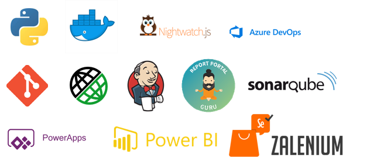

### Hi, I'm Bhargav Murari 

## Tools And Technologies I've Worked On

## Things I like to do
 ✍ Technical blogging.  
 🎶 Listening to music, while working.  
 💬 Sharing and Automation Tips and Tricks.  
 🌱 currently learning Typescript.
 
 ## Technical Certifications

[Verified Certificates](https://www.credly.com/users/bhargav-murarisetty.4929bd2d)

## Frameworks I am Currently Building

  

###  Do connect with me on:  

[LinkedIn](https://linkedin.com/in/bhargavmurari)  

📕 **Latest Articles**

[How To Achieve Machine Learning With Automation](https://bhargavmurari7.github.io/docs/Articles/ReportPortal)

