Hello Everyone,

Each year there is, of course, a lot of buzz about the future of test automation. At the outset of 2018, the big news was that AI and ML were coming and to be fair it did. Well, sort of. AI, ML, and Visual Testing are becoming an increasingly important and viable way to automate tests.

Today in 2020 Everyone wants to implement AI/ML in their product, result? We have witnessed the rise of Python aggressively since 2018.

As a test automation engineer, I always wanted to understand machine learning and how it can be useful in test automation, I am not talking about ML inside product or app, Just the plain test automation. Earlier I tried to build Business Intelligence Dashboard using **PowerBI** to strongly integrate with my tests and predict the test execution pass/fail trends based on historical execution results, and I came to the conclusion that BI Tools are not for Test Automation reporting purpose. And decided to explore further. My search came to an end with a small podcast from [Joe Colantonio](https://www.youtube.com/user/JoeColantonio).

**What is ML**: Machine learning is a method of data analysis that automates analytical model building. It uses algorithms that iteratively learn from data.

When your ML Engine learns from your test automation logs and tells you why the failure occurred, Then Congratulations.. you have achieved machine learning.

**What I Hate Most in Test Automation**:

Reporting, I always hate the Traditional and Most Popular reports like Allure, Klov, Extent, TestNg [considering only community editions and On-premise setup] Maintaining bulky HTML report sack is a mess, and there is no Historical data analysis we can achieve with it. Sending a simple pass-fail test analysis is not enough. Management might simply tell you to bring back a report with more passed tests. It would be better to show management how many bugs you avoided as a result of automated testing.

**What is [ReportPortal](https://reportportal.io/)**:

A powerful server-client reporting tool. Reduce the effort to work with results. Powered with Machine Learning, Providing historical data (statues) of executions in on click, logs, screenshots and any binary attachments. Trends, flaky test, most failed, longest test via custom widgets and dashboards, which give visibility to the team, leads, managers and falcon-eye view for VPs. Provide the ability to categorize fails by custom defect types and utilize power of Machine Learning to detect fails, based on collected patterns. Give benefits of real-time integration: no need to wait for execution ends. Any language, any platform. Free, Open Sourced. [Java integrations](https://github.com/reportportal?utf8=%E2%9C%93&q=agent-java&type=&language=)

There is no Much information on the internet about reportportal.io except their official documentation. Not sure why this **amazing tool** is shadowed by Extent, Allure, etc., Everyone in the Selenium communities on LinkedIn, FB says it is very difficult to implement reportportal and requires a powerful machine to implement it.


The moment I saw reportportal.io I was amazed by its features like Machine Learning, Pattern Analysis, etc., and I can’t stop myself from tasting it. Now I am convinced that ML in test automation can be achievable, and Reportportal.io is the best reporting mechanism ever seen in my career. And Big thanks to Dmitriy for such an initiative.

Benefits and Why you should migrate to it:

Machine Learning Capability
Live Reporting Mechanism [ Results become available the moment execution starts, you don't have to wait till the end]
Manage all your automation results and reports in one place
Fast Traceability with defect management tools like Jira/Rally.
Centralized reporting for your different test automation frameworks [selenium, Python, SOAP UI, Etc.]
Auto Analysis of issues based on Failure history
Build custom dashboards and metrics to learn from the past and predict trends
Multi-Language/Framework support


Setup:

There are two ways to setup reportportal.io

1.      The Hard way: Install a bunch of software and integrate them

2.      The Easy way: build using docker-compose.

I am going to build using docker-compose as it is very easy nowadays to build anything with dockers. And A Big thanks to Karthik KK and his ABC of Docker YouTube series helped me learning dockers a year ago. Since then I became a fan of Karthik, Docker, and its capabilities.

System Requirements and Involved Software:

The official integration steps from reportportal.io are based on deploying in a Linux environment, but in my project, I am using it in windows.

Remember this Instruction before implementing this on your project:

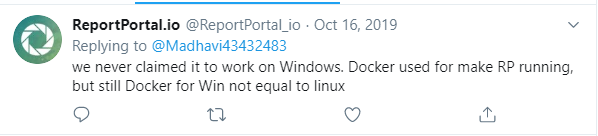


Operating System: Windows 10

Docker version: Any recent stable version [ I am using community edition]

Docker-compose: default compose version as my OS is windows

RAM: At least 5 GB of Dedicated RAM to Dockers

ReportPortal version: v4.3.0

Database: MongoDB

SearchEngine: ElasticSearch

Gateway: Fabio/ use tarefik if deploying in Linux         

Defect Management Tool: Jira/Rally

PORT: 8080 [if any of your services is already pointing to 8080 I suggest moving it to another port]

Volumes in use:

1.      mongo

2.      Consul

3.      ElasticSearch    

Docker Commands in use:

1.     Docker-compose up -d

2.     Docker ps

3.     Docker volume ls

4.     Docker container_name logs

5.     Docker-compose down

Execution Flow Diagram:

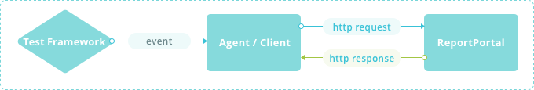

Supported Frameworks Integration:

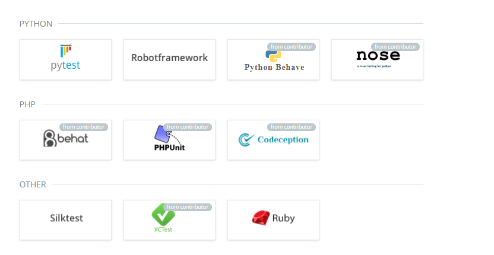

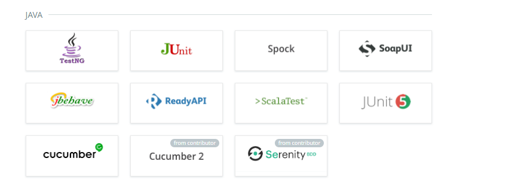

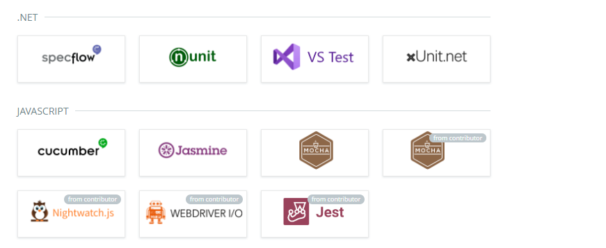

If your Tool/Framework is not listed above, you can create your own integration using its REST APIs.

Installation Steps:

1.      Download Docker from the official site and install it.

2.      Once install is complete make sure your Docker is UP and Running and Set RAM 5 GB.


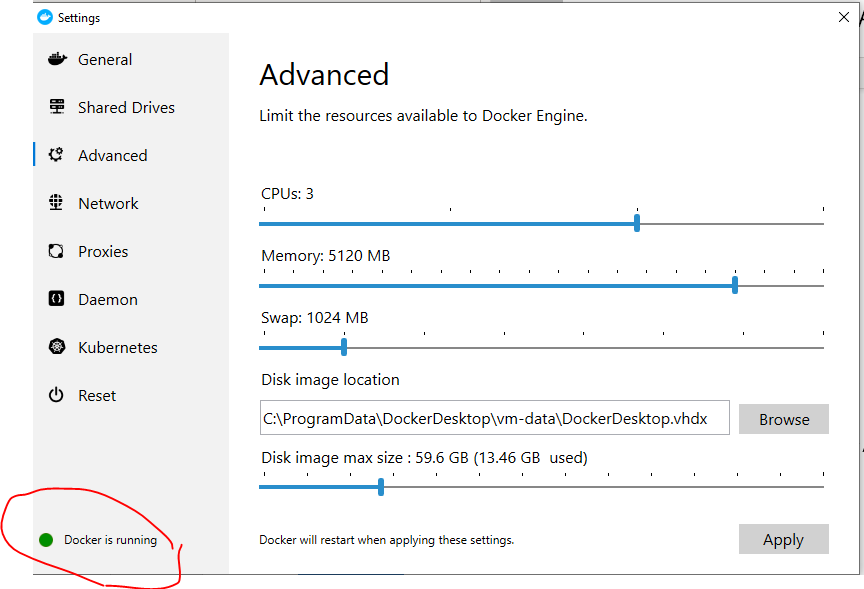

Now Copy paste my below optimized YAML file in your local drive and go to that path in PowerShell

https://github.com/reportportal/reportportal/blob/master/docker-compose.yml

You will require Docker knowledge on changing its volumes, debugging logs if reportportal doesn't come up.

Execute command 'docker-compose -f reportportal.yml -p reportportal up -d --force-recreate --build'


Where:

    1. '-p reportportal' -- specifies container's prefix (project name)

    2. '-d' -- enables daemon mode

    3. '--force-recreate' -- forces re-recreating of all containers

    4. ‘-f’ – specify compose file name

    5. ‘—build’ –build images properly before creating containers

Once you execute the above command you will see something like this.

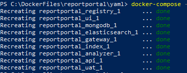

Now execute command ‘docker ps’ and make sure all containers are stable.

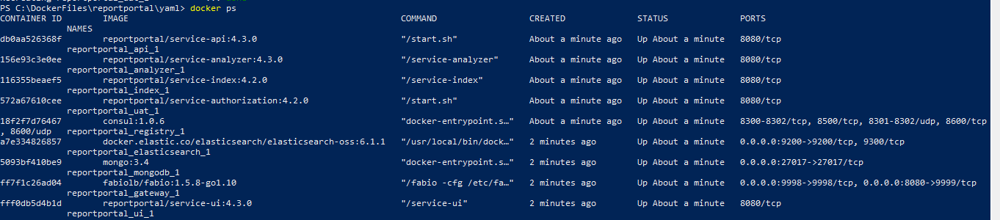

Now go to http://localhost:8080 and verify reportportal

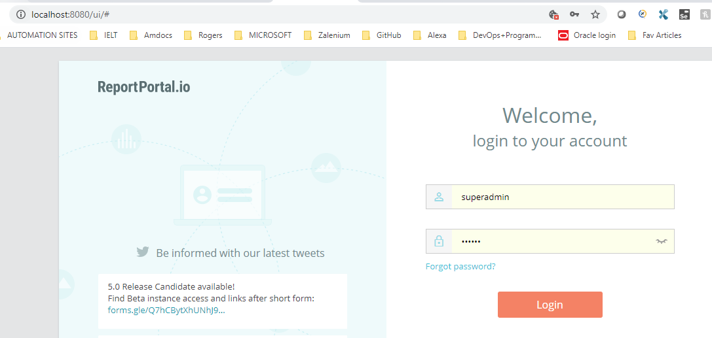

`Username: superadmin, Password: erebus [default ones]`

For security reasons, I suggest changing the admin password after login.

How to Integrate your test automation framework:

I am using a Selenium TestNG framework to test this. Source Code Github link

Follow the steps mentioned above and change the reportportal.properties file from the portal menu -> profile


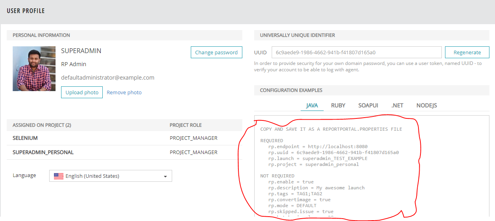
And add reportportal.properties file on your framework under the folder resources


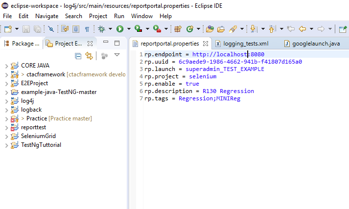


Add Listener in your testng.xml


```java
<listeners>

<listener class-name="com.epam.reportportal.testng.ReportPortalTestNGListener" />

</listeners>
```

Add Maven SureFirePlugin with the below properties.

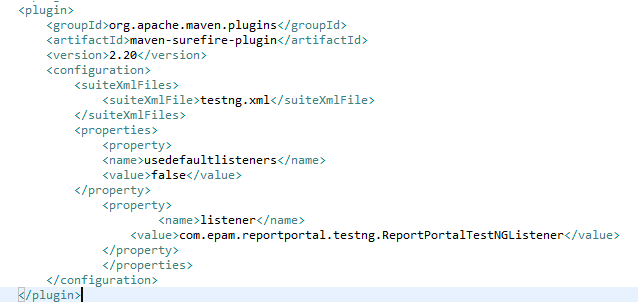

Add Below Dependencies to your POM.XML

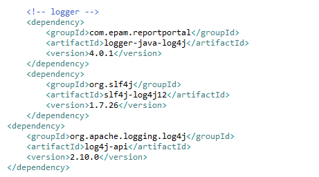

Run the Project as TestNG or Maven and see the data going inside reportportal live, Once your tests are complete your Dashboard will look like this.

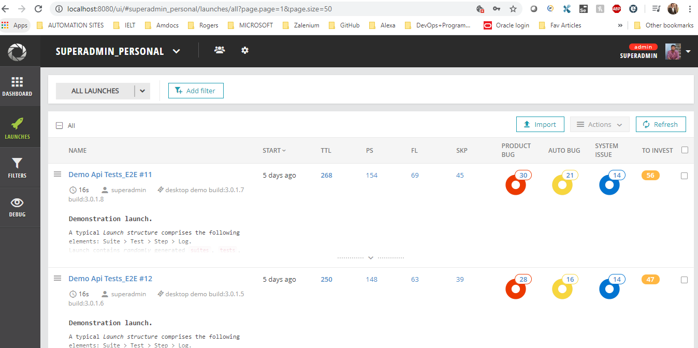

Now it is time to analyze the failures and Train your ML Engine. By Default, all failures go under the TO_INVESTIGATE section.

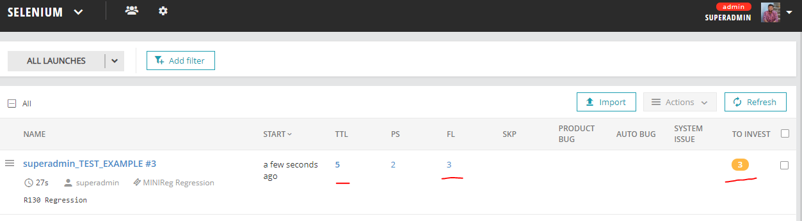

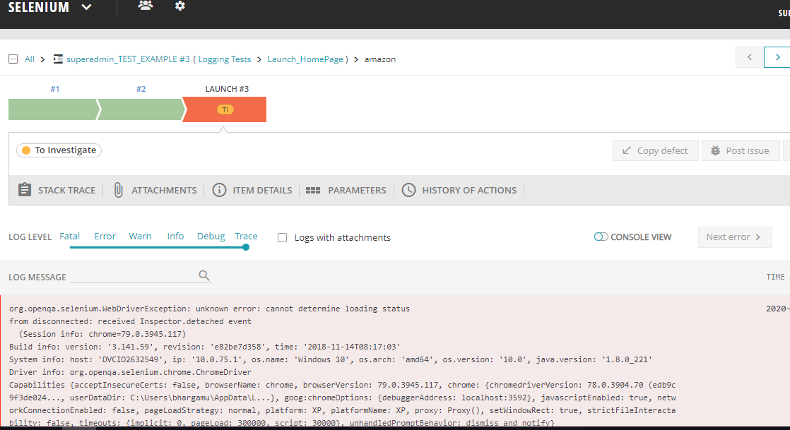

Now click on failures, Investigate the reasons and edit the comments accordingly. this will feed the analysis to ML Engine.


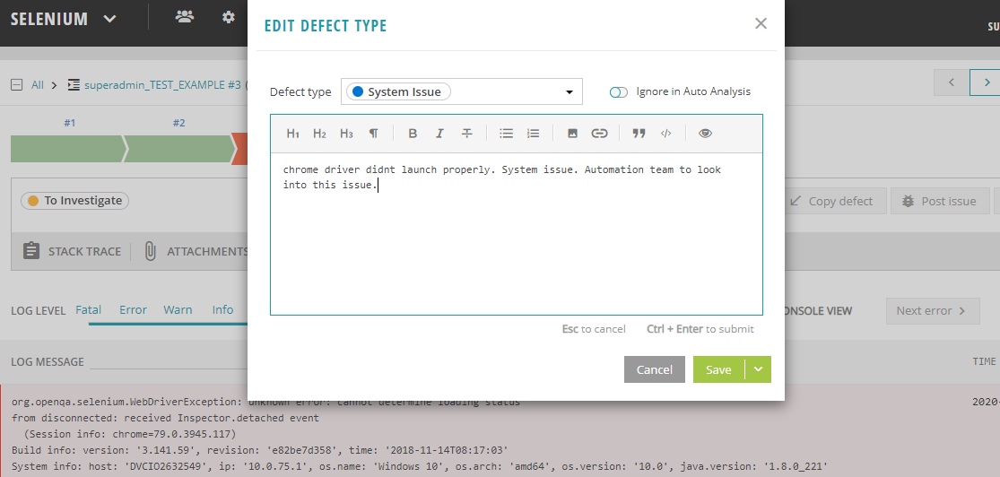

Run all your Scenarios multiple times and make sure you feed the Engine with proper comments and analysis by capturing all errors.

After Repeat this process for a couple of days and go to Settings -> turn Auto Analysis ON for Machine Learning.

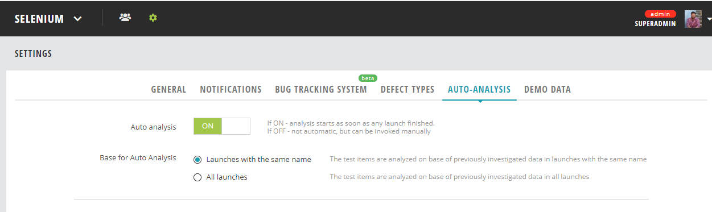

Now Run your tests once again and see how issues are analyzed automatically based on the training you gave to ML Engine.

Here AA means Auto Analyzed by ML Engine. Comments added from previous Run History automatically.

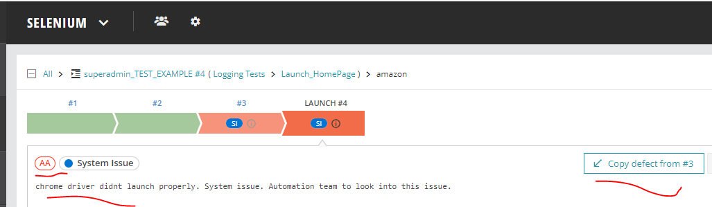
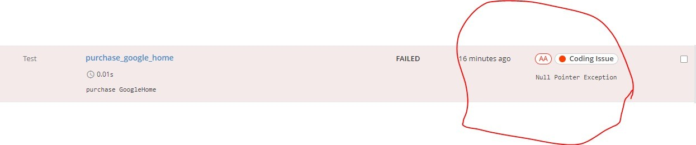

Also Attach Screenshots using TestNG Listeners when the test method fails.


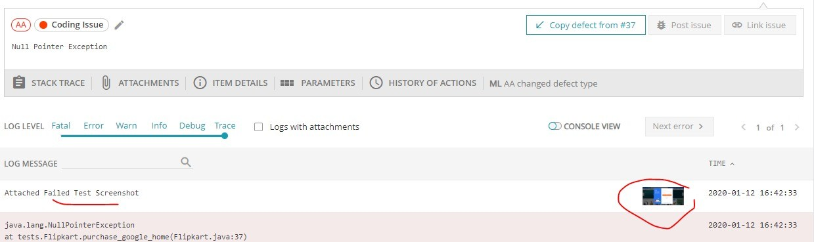

And that's it. You have achieved ML with the Best reporting mechanism.


