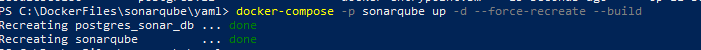
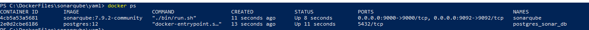
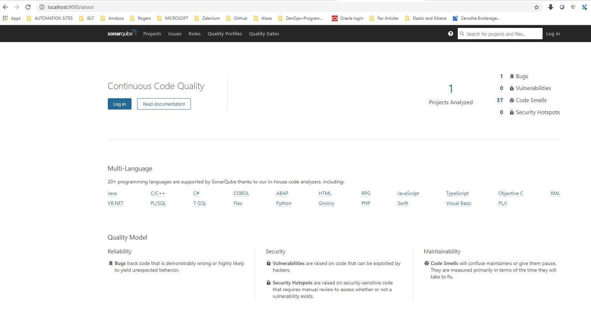
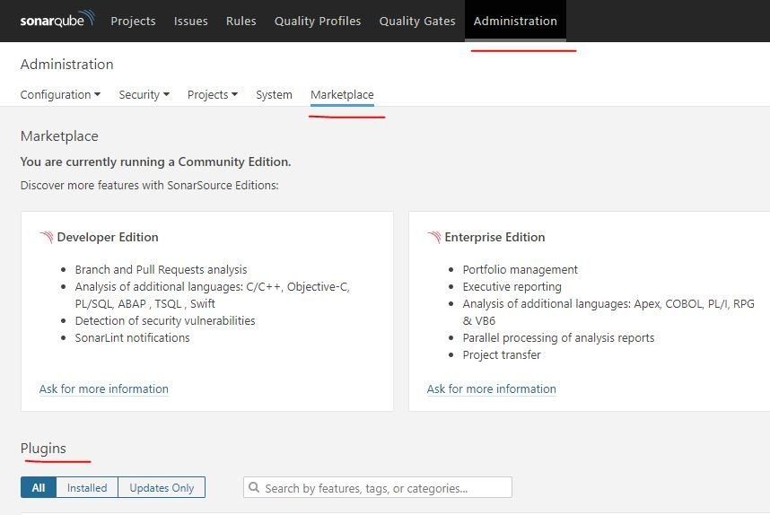
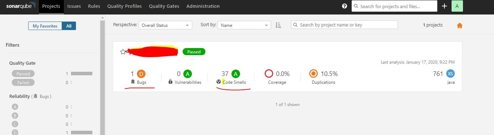
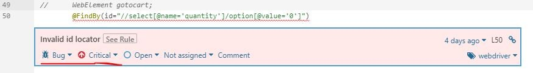
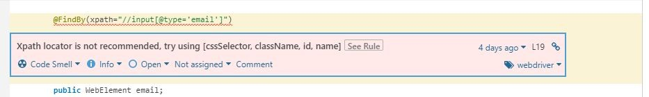

Why Code Quality is important: Writing good quality code is the Top Priority task while developing Automation Scripts. It should not be considered as a time-consuming task, but an essential investment for the project. It is the most effective way to lower technical debt. When the code is clean and elegant, it is easy to read, understand, maintain and extend.

Why Maintain Code Quality?

In Large scale project where the Automation team with a wide variety of coding styles, we often fail to deeply review the code of the entire project before adding something in middle. If the Functional team is helping you write New Tests or fixing the existing issues it is very important to Deeply review it before you deliver.

We can not always keep reviewing the code written by Team, It is a very time-consuming process.


No two persons in this world can maintain the same coding standards. And when Automation script fails, Management blames the automation team for delivering flaky code. Then You will end up in a situation like below.


Why Code Review by Humans is not an efficient method always:

Ask a programmer to review 10 lines of code, He'll find 10 issues. Ask a Programmer to review 500 lines of code, He'll say It Looks Fine
How to Achieve Code Quality?

People who are from development background needs no introduction to Sonarqube, In this article, I am going to explain how can we achieve Test Automation code Quality Using Sonar Qube.


What is SonarQube: A continuous code inspection tool that needs no Introduction.

SonarQube covers the 7 sections of code quality
- Architecture and Design
- Code smells
- Duplicated code
- Potential bugs
- Complex code
- Coding standards
- Comments

Software Requirements:

1. Sonarqube [Community Edition/Licensed]
1. Postgresql/MongoDB [Community edition/Licensed]

How to Setup:

There are different ways to set up SonarQube, I am going to set up using Docker Compose.

Here is my Compose File

```
version: "3"
	 
	services:
	  sonarqube:
	    image: sonarqube:7.9.2-community
	    container_name: sonarqube
	    restart: always
	    environment:
	      - SONARQUBE_JDBC_USERNAME=sonar
	      - SONARQUBE_JDBC_PASSWORD=password1
	      - SONARQUBE_JDBC_URL=jdbc:postgresql://db:5432/sonarqube
	    ports:
	      - "9000:9000"
	      - "9092:9092"
	    volumes:
	      - conf:/opt/sonarqube/conf
	      - data:/opt/sonarqube/data
	      - extensions:/opt/sonarqube/extensions
	      - bundled-plugins:/opt/sonarqube/lib/bundled-plugins
	      - logs:/opt/sonarqube/logs
	 
	  db:
	    image: postgres:12
	    container_name: postgres_sonar_db
	    restart: always
	    environment:
	      - POSTGRES_USER=sonar
	      - POSTGRES_PASSWORD=password1
	      - POSTGRES_DB=sonarqube
	    volumes:
	      - sonarqube_db:/var/lib/postgresql
	      - postgresql_data:/var/lib/postgresql/data
	 
	volumes:
	  postgresql_data:
	  sonarqube_db:
	  data:
	  conf:
	  extensions:
 
	  logs:
      bundled-plugins:
```
Store the above file as sonarqube.yml and run below command.

```docker-compose -p sonarqube -f sonarqube.yml up -d --force-recreate --build```





Now go to ```localhost:9000``` and login as ```admin/admin```



Add below Plugin in POM.xml

```
<plugin>
 <groupId>org.sonarsource.scanner.maven</groupId>
 <artifactId>sonar-maven-plugin</artifactId>
 <version>3.6.0.1398</version>

</plugin>
```

                

Add Below in maven folder settings.xml in your system.


```
<pluginGroups>
   <pluginGroup>org.sonarsource.scanner.maven</pluginGroup>
</pluginGroups>

<profile>
  <id>sonar</id>
    <activation>
      <activeByDefault>true</activeByDefault>
    </activation>
    <properties>
      <sonar.host.url>http://localhost:9000</sonar.host.url>
     </properties>
</profile>
```

in above snippet, localhost:9000 is location where my sonarqube is running.

Now go to localhost:9000 and download the webdriver plugin from Administration -> Marketplace -> Plugins



Now go to Command Prompt and run below command

```mvn sonar:sonar```

Once you see Build as success then go back to sonarqube and check the results.

For the Demo purpose, I have uploaded a basic maven framework with common writing standards to produce the results. [ Do Not Judge My Coding Standards Based on Below, I Can Write Better Code :D ]



Now Click on Bug and see what is the issue.

It has identified a Broken Xpath in my code and marked it as a Bug.

No alt text provided for this image
It also tells me that regular xpaths are not recommended, ID, ClassName or CSS is more preferred.



I can see how much amount of Duplicate lines of code I have written, it helps me to concentrate more on code re-work and reusability of functions wherever possible.



That's it Guys if you are Not using SonarQube for Test Automation. I suggest you should implement and take benefits from it.

Happy Testing...


