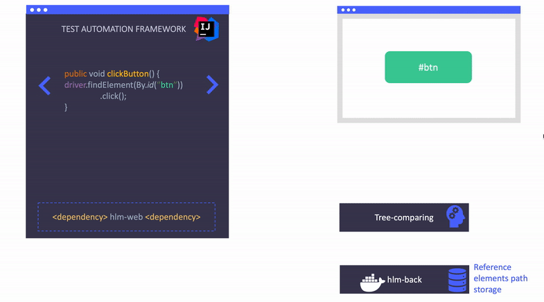
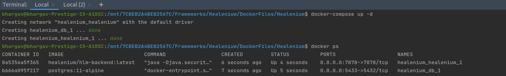
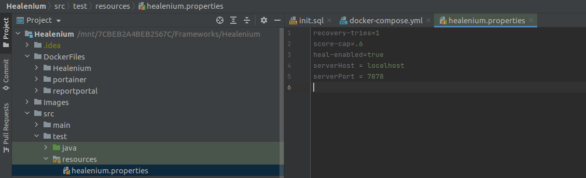
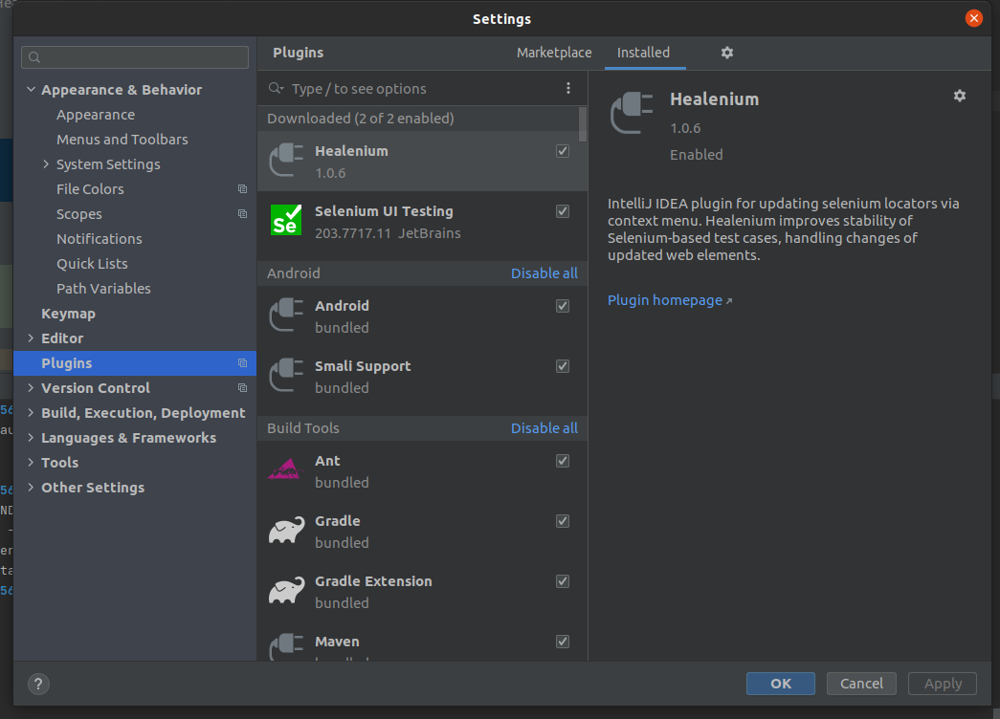
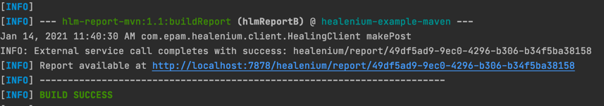
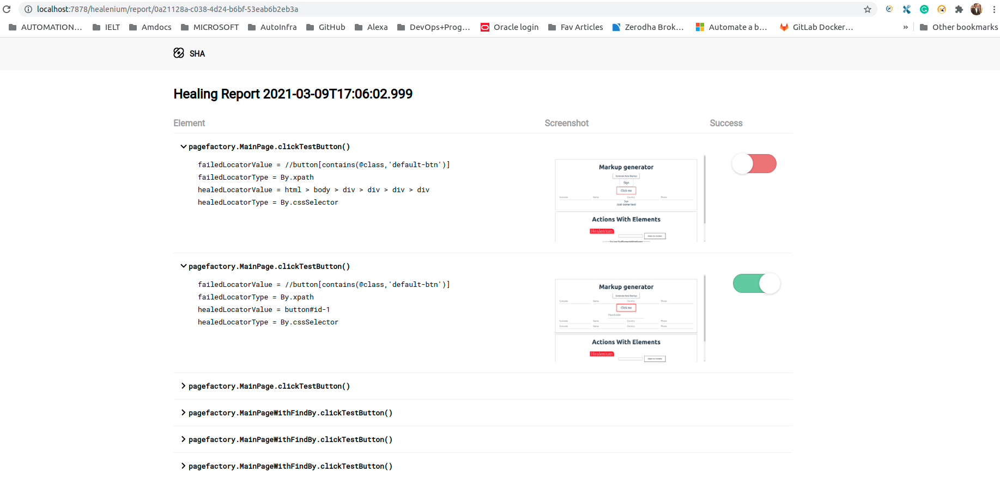

## Healenium - An OpenSource Self Healing Test Automation solution

Images/Healenium/banner.jpeg
### What is Self Healing:

  Self Healing in testing is a mechanism that detects object changes in the product and intuitively updates with new attributes to ensure test cases are functional. 
  
  For example, if the ‘id’ or ‘class’ attributes of an element on a web page is changed by the developer, then the existing automated test script need also be changed. This may sound simple, but if there are many such changes in the application, this takes a lot of time and effort for the testers to modify tests and run them.

This is where the [Healenium](https://healenium.io/) comes to help.


**Is Healenium a wrapper of selenium?**

Kind of, It creates a **delegate** to the selenium WebDriver object instance.

Delegation means that you use an object of another class as an instance variable, and forward messages to the instance. ... Delegation can be viewed as a relationship between objects where one object forwards certain method calls to another object, called its delegate (creating a delegate means you are wrapping the object)

**How Does it Exactly Heal at RunTime?**

The Healenium delegate ads try/catch Block around WebDriver NoSuchElement Exception In runtime replaces failed controls with a new value that matches the best and performs an action with replaced control successfully.

Here is the flow diagram from the official website.



**In a nutshell: **
Healenium backend services stores the page state and refer it whenever there is a NoSuchElement exception in future for the same page.
Setup:

**Software Requirements:**

1. Docker
2. IntelliJ [sorry eclipse users]
3. Maven/Gradle Selenium Project
4. Healenium IntelliJ Plugin

**Let's See What are Changes required to Implement Healenium.**

**Step1:**

Open your Selenium Project and Create Folder structure as below `DockerFiles/Healenium/db/sql`. 

:::tip Pro tip 

you can change this folder structure but the related path must be updated in docker-compose file too

:::

Copy below commands and save in the "init.sql" file as per below.

``` CREATE SCHEMA healenium AUTHORIZATION healenium_user;  GRANT USAGE ON SCHEMA healenium TO healenium_user ```


![image] (Healenium/1.png)

**Step2:**

Copy the below commands and place it in a docker-compose.yml file like shown in the above image.

```text title="docker-compose.yml"
// highlight-start

version: "3.3"

services:

  db:
    image: postgres:11-alpine
    ports:
      - "5433:5432"
    volumes:
      - ./db/sql/init.sql:/docker-entrypoint-initdb.d/init.sql

    restart: always
    environment:
      - POSTGRES_DB=healenium
      - POSTGRES_USER=healenium_user
      - POSTGRES_PASSWORD=YDk2nmNs4s9aCP6K
    networks:
      - healenium

  healenium:
    image: healenium/hlm-backend:latest
    ports:
      - "7878:7878"
    restart: always
    links:
      - db
    environment:
      - SPRING_CONTAINER_NAME=healenium
      - SPRING_POSTGRES_DB=healenium
      - SPRING_POSTGRES_USER=healenium_user
      - SPRING_POSTGRES_PASSWORD=YDk2nmNs4s9aCP6K
      - SPRING_POSTGRES_URL=jdbc:postgresql://db:5432/healenium?currentSchema=healenium
    networks:
      - healenium

networks:
  healenium: 
// highlight-end

```


Bring the Healenium Backend Services UP by running the command `docker-compose up -d`. Once successful you will see the status of the containers like below.
No alt text provided for this image



**Step3:**

Place Healenium Properties File under src\test\resources\healenium.properties file

```text title="healenium.properties"
// highlight-start
score-cap=.6
heal-enabled=true
serverHost = localhost
serverPort = 7878
// highlight-end

Here server host is where your docker is running.
```


**Step4:**

Install Healenium IntelliJ Plugin


**Step5:**

Create delegate to webdriver like below

```text title="Initiate Healenium Like Below"
// highlight-start
// Create a selenium webdriver instance as Usual

WebDriver seleniumdriver = new ChromeDriver();

//Create Healenium Driver [this is new]

SelfHealingDriver driver = SelfHealingDriver.create(seleniumdriver);

// Write your selenium Program As Usual.

driver.manage().window().maximize();
// highlight-end

```

**Step6:**

Add Healenium maven dependency in pom.xml file

```text title="pom.xml"
// highlight-start

<repositories>
 <repository>
  <snapshots>
    <enabled>false</enabled>
  </snapshots>
  <id>bintray-epam-healenium</id>
     <name>bintray</name>
     <url>https://dl.bintray.com/epam/healenium</url>
 </repository>
</repositories>


<dependency>
  <groupId>com.epam.healenium</groupId>
  <artifactId>healenium-web</artifactId>
  <version>3.0.2</version>

</dependency>

// highlight-end


```

**Final Step:**

Now run your tests using the Maven command `mvn clean test` and get the healing reports automatically.




Here is the [sample project](https://github.com/AutoInfra/HealeniumTestng)  to demonstrate Healenium capabilities.

Here is the [Official Healenium Repo](https://github.com/healenium/healenium-web)  with More Detailed Step By Step Instructions

Enjoy......