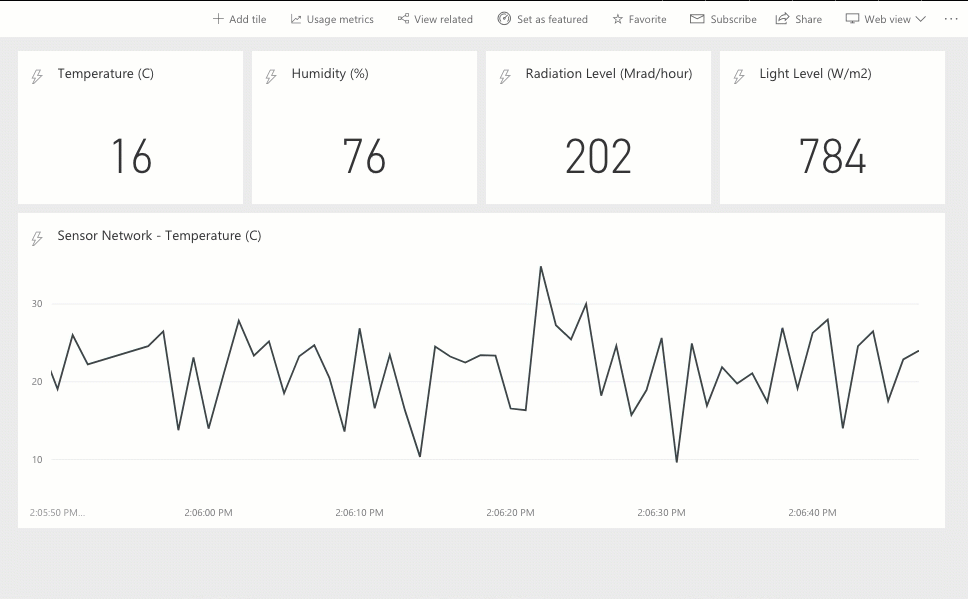
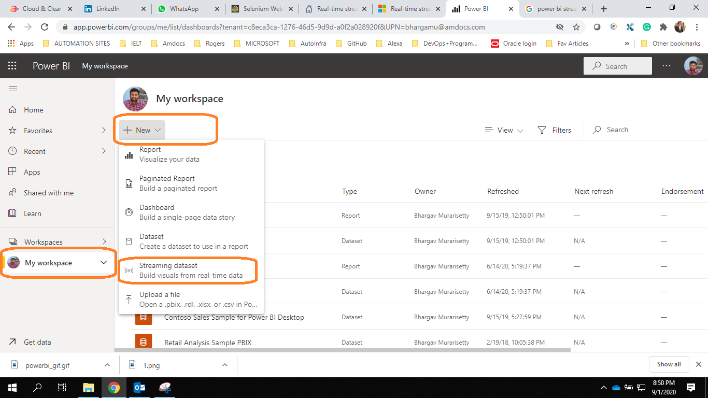
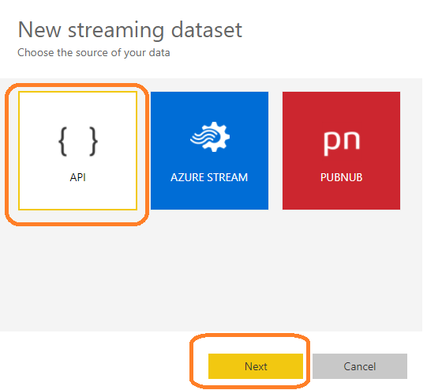
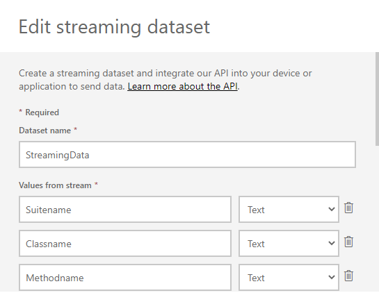
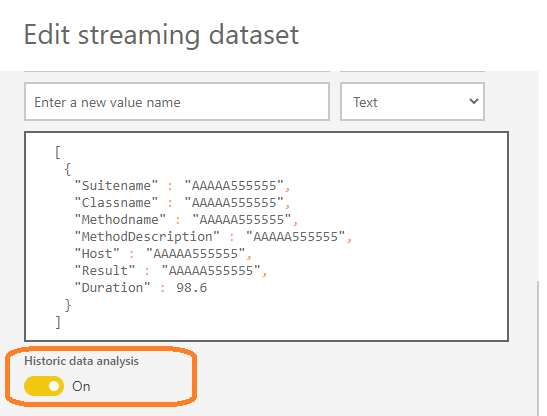
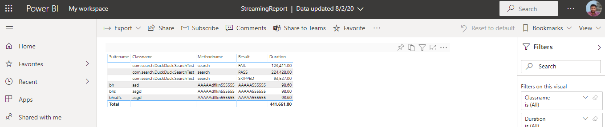
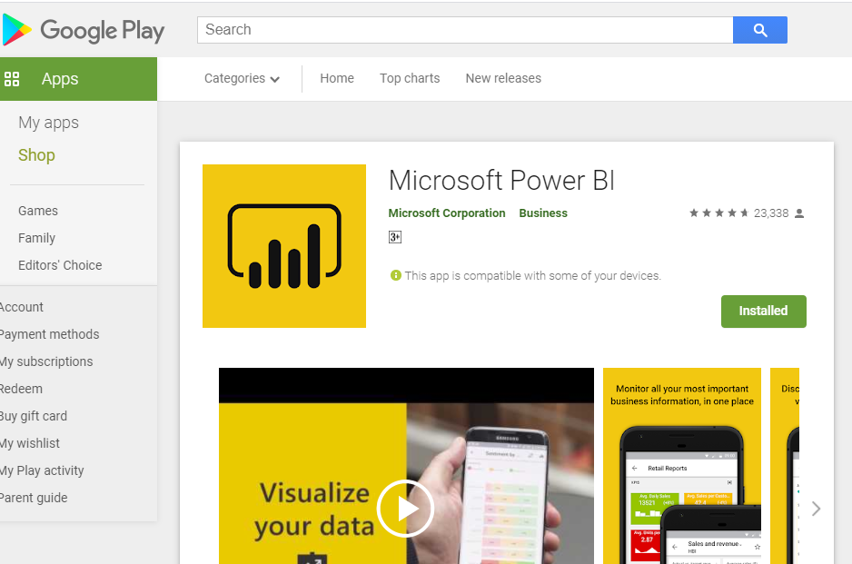
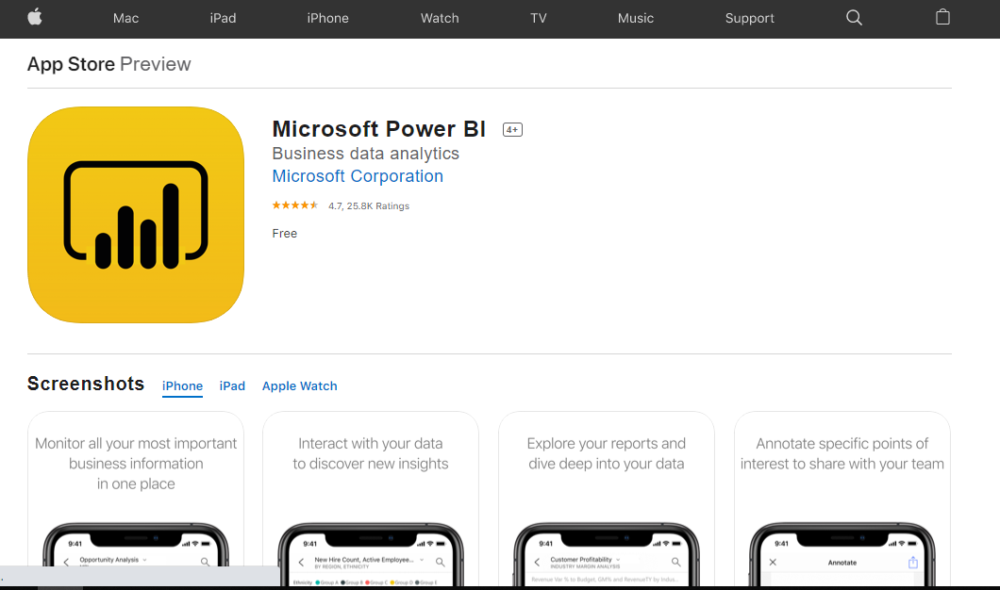

## Stream Test Results To PowerBI And Watch It Live From Mobile App


**Overview:**
Running automated regression on a daily basis as part of the daily build is inevitable nowadays! It is cool to find & report the issues as soon as they are introduced. But it is very painful to maintain hundreds of automated tests & remote parallel execution! Once you have a huge automated regression test suite in place, you might have split it into multiple test suites based on business modules and you might be running them in parallel as part of your daily automated regression. Most of these automated regression suites run in a remote VM and the test results are created / accessible only at the end of the test execution. Otherwise, you might need to look into jenkins console for the test execution results log to see the progress. It might be annoying in certain cases. It might be cool to have a solution which gives us the test execution results while the tests are being executed in the remote VMs.

To overcome the above problem we can use PowerBI streaming Dataset and build our own dashboard.


**Pros:**

- Realtime Streaming of Test Results
- Nice Dashboards
- Stream Execution results on Mobile

Cons: [This is negligible to me, might vary with others]

- Old data gets flushed automatically [after 200,000 Rows]
- Old data gets flused after 20 mins

**Why Use PowerBI Streaming Dataset?**

These days Microsoft is including PowerBI basic license to every organization as a part of their office365 License, Why waste it when it is available already?
This Streaming Dataset comes with Rich RestAPI endpoints which makes it easy to Push DataSet
Okay, That's too much of overview, lets dive into how can we implement it.

**Step1: Click on Create Streaming Dataset**



**Step2:**



**Step3:**

Enter the Test results Fields you want to stream


**Step4:**

Once you create columns, make Sure Historic Analysis is turned ON, Now click on Create and Click on PowerShell.




Once you complete this you will get a sample PowerShell script to send the data to streaming dataset like below.


```json
$endpoint = "https://api.powerbi.com/beta/{YOUR_DATASET_URL}
$payload = @{
"Suitename" ="AAAAA555555"
"Classname" ="AAAAA555555"
"Methodname" ="AAAAA555555"
"MethodDescription" ="AAAAA555555"
"Host" ="AAAAA555555"
"Result" ="AAAAA555555"
"Duration" =98.6
}

Invoke-RestMethod -Method Post -Uri "$endpoint" -Body (ConvertTo-Json @($payload))
```

Let's Start Implementing this in Framework:

Maven POM Dependencies:

```java
<dependency>
    <groupId>io.rest-assured</groupId>
    <artifactId>rest-assured</artifactId>
    <version>4.3.0</version>
</dependency>
<dependency>
    <groupId>org.testng</groupId>
    <artifactId>testng</artifactId>
    <version>7.1.0</version>

</dependency>
```
As PowerBI Streaming dataset accepts only JSON Form of data we need to create our own pojo classes to send the data.


```java
public class PowerBI_Pojo_Base {

    public List<PowerBI_Pojo> rows;

    public List<PowerBI_Pojo> getRows() {
        return rows;
    }

    public void setRows(List<PowerBI_Pojo> rows) {
        this.rows = rows;
    }


}
```

Main POJO Class:

```java
@Builder
public class PowerBI_Pojo {
    private String Suitename;
    private String Classname;
    private String Methodname;
    private String MethodDescription;
    private String Host;
    private String Result;
    private long Duration;

  
}
```

Itestlistener Class:


```java
public class PowerBI_Listener implements ITestListener {

    private  PowerBI_ResultSender PowerBI_ResultSender;
    private ITestContext ITC;

    @Override
    public void onTestStart(ITestResult result) {
        this.PowerBI_ResultSender = new PowerBI_ResultSender();
    }

    @Override
    public void onTestSuccess(ITestResult result) {
        this.sendStatus(result,"PASS");
    }

    @Override
    public void onTestFailure(ITestResult result) { this.sendStatus(result,"FAIL");
    }

    @Override
    public void onTestSkipped(ITestResult result) {
        this.sendStatus(result,"SKIPPED");
    }

    @Override
    public void onTestFailedButWithinSuccessPercentage(ITestResult result) {
        //SKIP
    }

    @Override
    public void onTestFailedWithTimeout(ITestResult result) {this.sendStatus(result,"Time Out");}

    @Override
    public void onStart(ITestContext context) {
        //SKIP
        this.ITC=context;
    }

    @Override
    public void onFinish(ITestContext context) {
        //SKIP
    }

    public void sendStatus(ITestResult ITR, String status){

        long Duration = ITR.getEndMillis() - ITR.getStartMillis();

        PowerBI_Pojo p = PowerBI_Pojo.builder()
                .Suitename(ITC.getCurrentXmlTest().getSuite().getName())
                .Classname(ITR.getTestClass().getName())
                .Methodname(ITR.getMethod().getMethodName())
                .MethodDescription(ITR.getMethod().getDescription())
                .Host(System.getProperty("user.name"))
                .Result(status)
                .Duration(Duration)
                .build();

        List<PowerBI_Pojo> List = new ArrayList<PowerBI_Pojo>();
        List.add(p);
        PowerBI_Pojo_Base PB = new PowerBI_Pojo_Base();
        PB.setRows(List);
        PowerBI_ResultSender.PushData(PB);
    }

}
```

PowerBI Result Sender Class:


```java
public class PowerBI_ResultSender {

    private static final String APIKEY = "APIKEY";
    private static final String PowerBiServer = "https://api.powerbi.com";
    private static final String UPN_VALUE = "UPN_VALUE";
    private static final String Tenant_Value ="TENENT_VALUE";
    private static final String DataSet ="PUSH_DATA_SET";

    public void PushData(PowerBI_Pojo_Base PowerBI_Json_Result)  {

        RestAssured.baseURI = PowerBiServer;
        RestAssured.useRelaxedHTTPSValidation();
        //RestAssured.proxy("YOUR_PROXY", 8080);

        String Json_Payload = new Gson().toJson(PowerBI_Json_Result);
        try {
            given()
                    .header("Content-type", "application/json")
                    .queryParam("tenant", Tenant_Value)
                    .queryParam("UPN", UPN_VALUE)
                    .queryParam("Key", APIKEY)
                    .urlEncodingEnabled(false)
                    .body(Json_Payload)
                    .when().log().all().post(DataSet)
                    .then().log().all().assertThat().statusCode(200);
        }
        catch (Exception e) {
            //e.printStackTrace();
        }

    }
}
```

Add Listener class in TestNG XML as Below:


```java
<listeners>

     <listener class-name="listeners.PowerBI_Listener"/>

</listeners>
```

Now Navigate to PowerBI and Check your Results, Live Streaming to Dataset create above.

No alt text provided for this image
Note: Above test results showed are only for reference purpose, This is an experimental activity, Do Let me know your story when you implement this.

**Final Step:**

:::tip Pro tip 

Once your dashboard is ready Download PowerBI Android/IOS App and Sign in, view your dashboard on mobile from anywhere.

:::






Last but not least, Special Thanks to Sudarshan Selvaraj, Karthik KK , vinoth selvaraj and Sai Krishna Kurada for their Contributions to Automation community and motivating me to share tips.
