## Run Selenium Tests in AzureDevOps
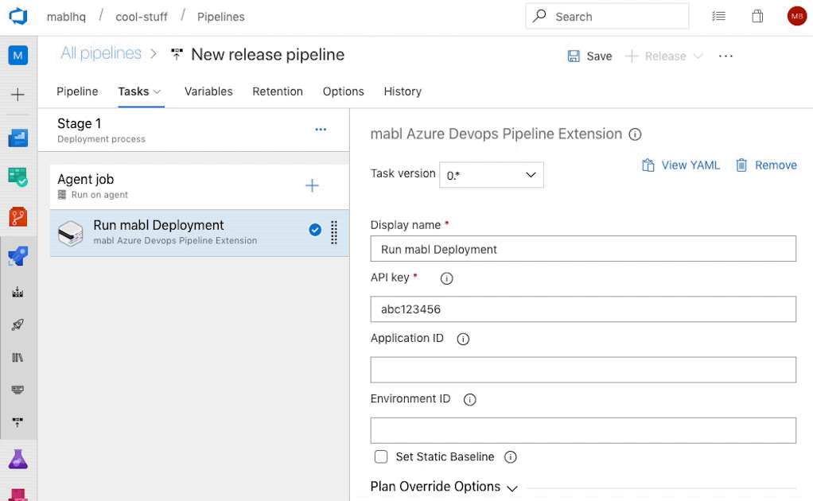

In This Article lets see how to run your Selenium Tests in AzureDevOps

**What is Azure DevOps and Azure Pipelines?**

Google It, you will find out :)

**Advantages for Test Automation :**

- Wide Range of OS [Linux, Windows or Mac] you can choose. List of available VMs can be seen here
- Easy Pipeline Configuration [Either start from Scratch using yaml or use GUI options]
- Wide Range of External Connectors
- Supports Docker and Kubernetes Image build and Push
- Free for OpenSource Projects

**How to Run Selenium Tests?**

If you are using selenium I assume you might be using Maven as your Build Tool. As pipelines configuration and execution happens via command line we will use Maven build commands to run our tests.

Prerequisites:

-     Maven
-     Testng.xml

**Step1:**Create a free account at dev.azure.com

**Step2:**Go to Pipelines and Click on New Pipeline

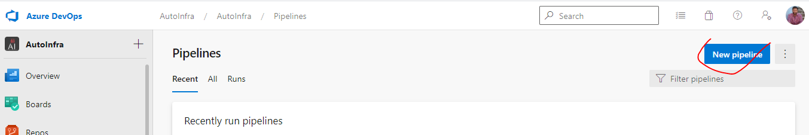

Step3: Select the Source of your Code [In my case it is GitHub]

if this is your first time, you can upload your code to Azure Repos [available just above the pipelines]

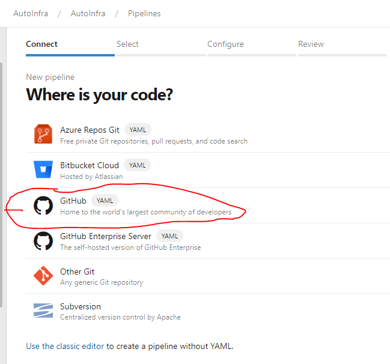
Step4: Select your Repo

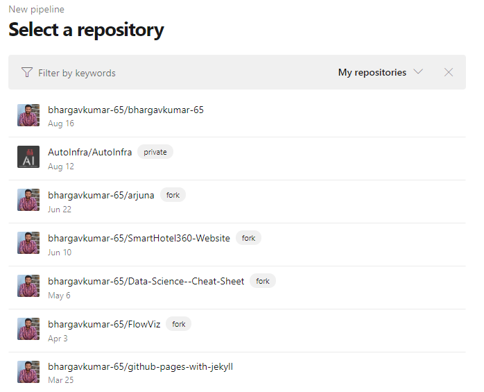
Step5: You will see a lot of pipeline Configuration Options, As our goal is run framework using Maven build, Click on Show more.

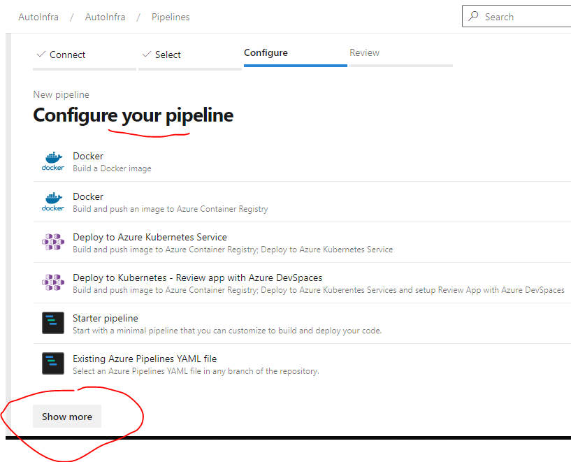
Now Click on Maven

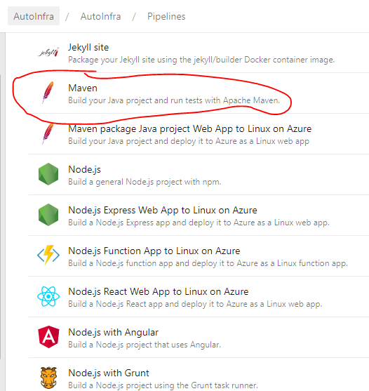
Step6:

It is time to Review our Pipeline, Some changes we need to do like choosing windows over ubuntu or mac over ubuntu/windows [depending on your requirement]

you can choose your JDK version if using java 9 and above.

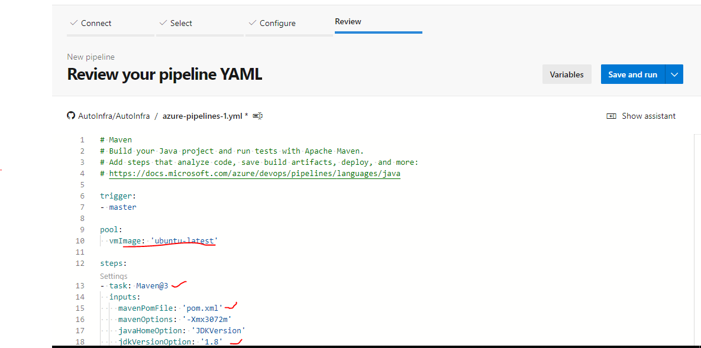
List of available OS Agents can be found here

Here is my Pipeline yaml, you can refer it and change as per your needs.

```yml
#@Owner: Bhargav Murari 
#type: Starter pipeline
#Add steps that build, run tests, deploy, and more:
#Full yaml config options:  https://aka.ms/yaml


trigger:
    branches:
      include:
      - master 
      
    paths:
      exclude:
      - additions.md
      - ChangeLog.Txt
      - README.md
jobs:
  - job: 'TestRun_in_Windows' #Name of Job
    pool:
      vmImage: 'windows-latest' 

    steps:
    - task: Maven@3
      inputs:
        mavenPomFile: 'pom.xml'
        goals: 'verify sonar:sonar test'
        options: '-DGRID_TYPE="NO_GRID"'
        publishJUnitResults: true
        testResultsFiles: '**/surefire-reports/TEST-*.xml'
        javaHomeOption: 'JDKVersion'
        jdkVersionOption: '1.8'
        mavenVersionOption: 'Default'
        mavenAuthenticateFeed: false
        effectivePomSkip: false
        sonarQubeRunAnalysis: true
        sqMavenPluginVersionChoice: 'pom'
```


Lets Dive into above yaml:

**trigger** : Specify your branch to be pulled and executed.

**exclude**: List of file changes to be untracked after commit. [you can eliminate un necessary builds]

**Jobs**: List of Jobs to Run one after other, [refer this to a jenkins job like]

**Pool**: Azure Devops OS Pool

Vm Image: 'Windows-Latest' or choose one from here

goals: Your Maven Goal

options: your Maven -D Options

Make sure you have defined your testng.xmls in maven surefire plugin path like below

```xml
<plugin>
   <groupId>org.apache.maven.plugins</groupId>
      <artifactId>maven-surefire-plugin</artifactId>
         <version>2.20</version>
             <configuration>
                 <suiteXmlFiles>
                    <suiteXmlFile>TEST_NG XML 1</suiteXmlFile>
                    <suiteXmlFile>TEST_NG XML 2</suiteXmlFile>
                  </suiteXmlFiles>
                     <properties>
                        <property>
                            <name>usedefaultlisteners</name>
                             <value>false</value>
                        </property>
                     </properties>
               </configuration>
</plugin>
```

Now Click on Run and See your results

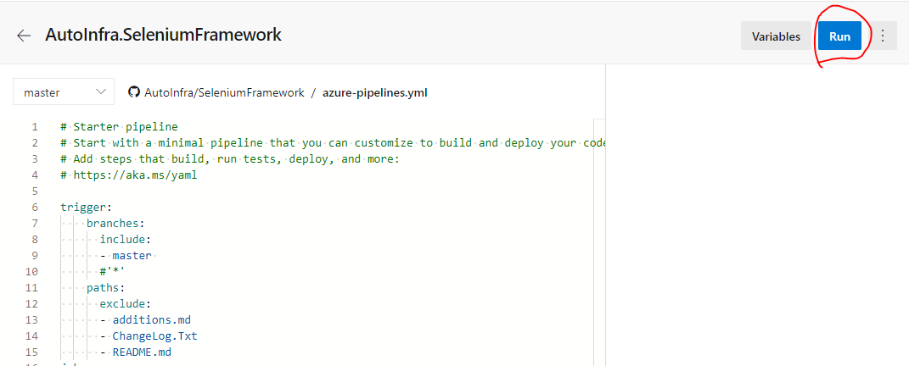
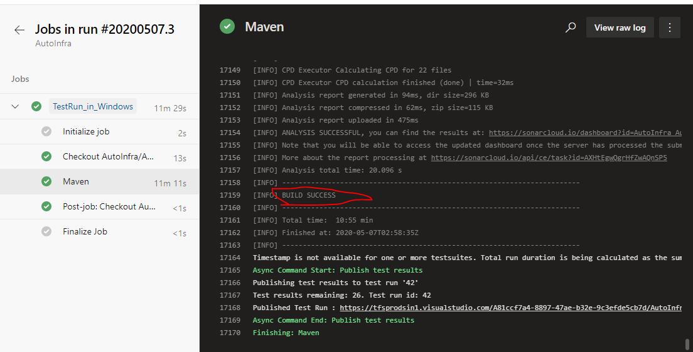
After Couple of Runs you will get Test analytics of Your Pipeline like Below.

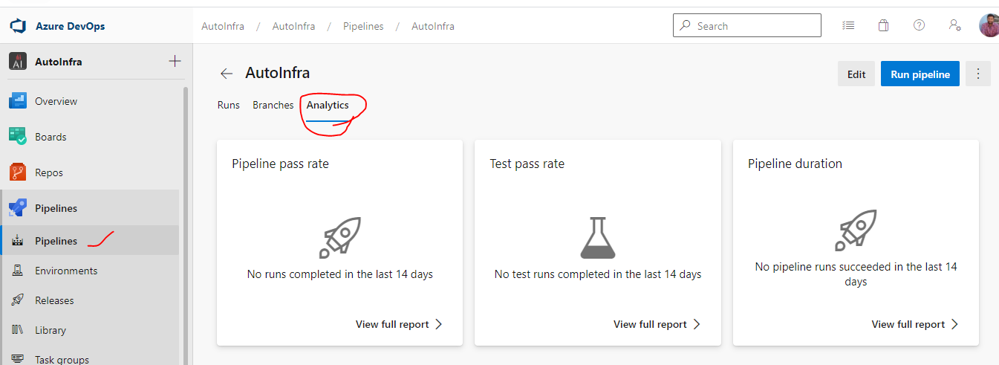
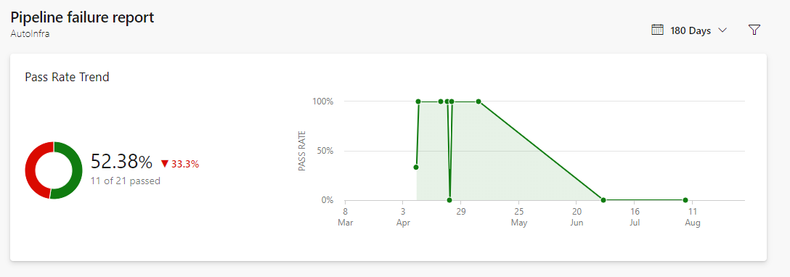
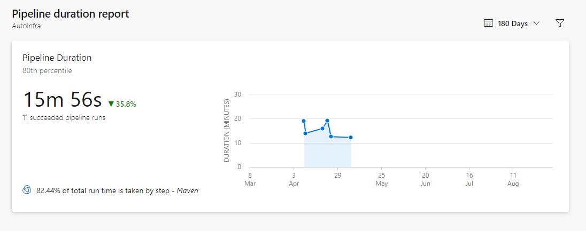
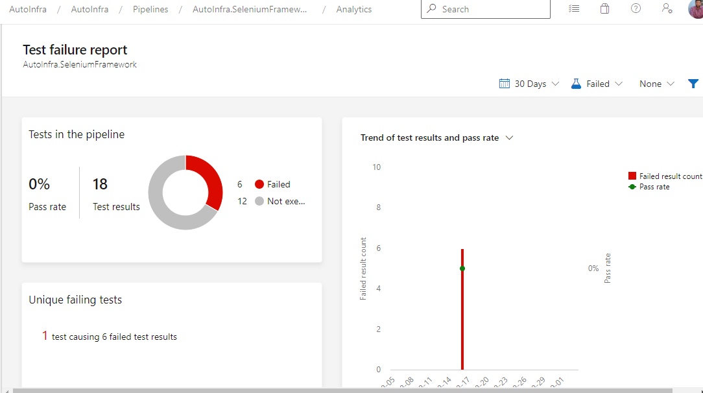
Happy Learning :)

