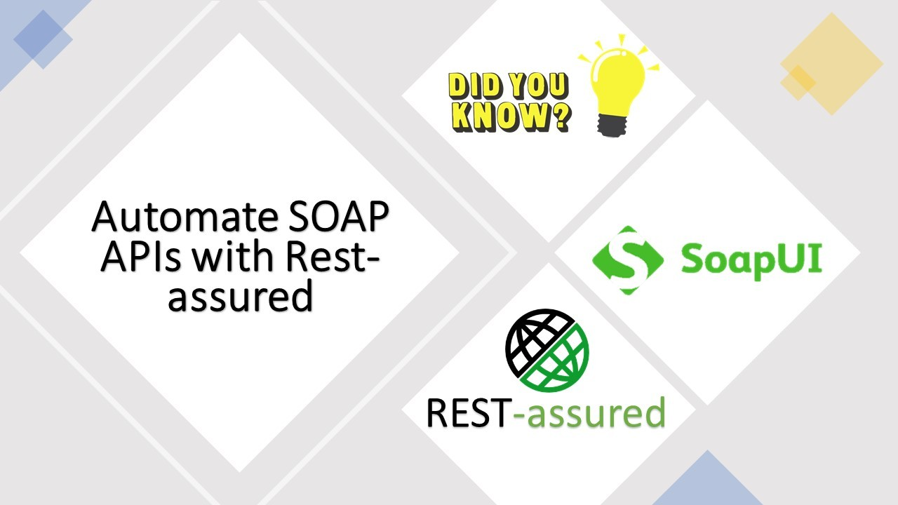

## Automate SOAP APIs using Rest Assured


I recently came across a task to automate SOAP APIs using Rest Assured.

Before accepting this task I've been in a misconception that Soap APIs can't be automated using rest assured (popular for Rest API Automation) and it can be only achievable with SOAP UI tool.

**Pre-Requisites:**
-     Rest-Assured Automation Knowledge

**Advantages of RestAssured over SoapUI.**

- Open Source
- More flexibility over Automation solution design [Interacting with 2 or more Apps APIs for an E2E Flow, Data Providers etc.,]
- No need to any pro version for things like reporting etc., [Soap UI Pro]

**What are the different API Calls available for SOAP APIs?**

Rest APIs have different calls like GET, POST, PUT, UPDATE, DELETE etc., Unlike Rest SOAP has two calls GET and POST. Although GET Is available as per SOAP API docs, i never came across where I need to invoke GET Call. All the Get Calls are executed via POST Mechanism [input XML structure defines what to respond]

Let's See How to Use RestAssured for Automating SOAP APIs
BaseClass - Here I'm writing request and Response spec builders.

Carefully see the Headers section in below httpSoapRequestSpecBuilder method, You Must add .addHeader("SoapAction",add) to tell RestAssured that this is a SOAP API Call.


```java
public class BaseClass  {

protected RequestSpecification httpSoapReqSpecBuilder()
{
    RequestSpecification xmlReqSpecBuilder= new RequestSpecBuilder()
            .setBaseUri("YOUR_BASE_URL")
            .setContentType(ContentType.XML)
            .addHeader("HEADER1","VALUE")
            .addHeader("HEADER2","VALUE")
            .addHeader("SOAPAction","add")
            .build();
    return xmlReqSpecBuilder;
}

   public void validate(File inputxml, Response response)
    {
        XmlPath requestbody = new XmlPath(inputxml);
        XmlPath responebody = new XmlPath(response.asString());
        String responsecode = responebody.getString("ns1:code").substring(0,10);
        Assert.assertEquals(responsecode,"0000000000");
        writeInExtentRepInfo(requestbody.prettyPrint(),responebody.prettyPrint());
    }
}
```

How to Write Assertions?
if you are familiar with jsonpath then you can relate it to xmlpath class provided by RestAssured Library.

BaseClass has validate method which uses XmlPath to get the Data and assert it. Consider your API Response is as below then your assertion will be like below. Remember to add .text() method at the end of the traverse.

Sample Assertion


```java
Assert.assertEquals(response.getString("soapenv:Envelope.soapenv:Body.tag0:SomeText.tag1:SomeRandomTest.tag2:responseInfo.ns1:code.text()"),"0000000000");
```
Sample OutputXML

```xml
<?xml version="1.0" encoding="UTF-8"?>
    <soapenv:Envelope xmlns:soapenv="http://schemas.xmlsoap.org/soap/envelope/">
        <soapenv:Body>
            <tag0:SomeText>
                <tag1:SomeRandomTest>
                    <tag2:responseInfo>
                        <ns1:code>0000000000</ns1:code>
                    </tag2:responseInfo>
                </tag1:SomeRandomTest>
            </tag0:SomeText>
        </soapenv:Body>
    </soapenv:Envelope>
```

Below is the TestClass.
API Call is POST


```java
public class testClass extends BaseClass {

    @Test(priority = 1, description ="YOUR_DESCRIPTION")
    public void getDataMethod() {
        File input = new File("INPUT_XML_FILE_PATH");
        Response response = RestAssured.given()
                .spec(httpSoapReqSpecBuilder())
                .body(input)
                .when().post()
                .then().assertThat().statusCode(200).contentType(ContentType.XML).extract().response();

        validate(input, response);
    }
```

TestNG XML


```xml
<?xml version="1.0" encoding="UTF-8"?>
<!DOCTYPE suite SYSTEM "https://testng.org/testng-1.0.dtd">
<suite name="CompareRequests">
<listeners> <listener class-name="listeners.ExtentListener"/> </listeners>
    <test name="EXAMPLE_TEST_LINKEDIN">
        <classes>
            <class name="testClass" >  </class>
        </classes>
    </test>
</suite>
```

Enjoy :)
