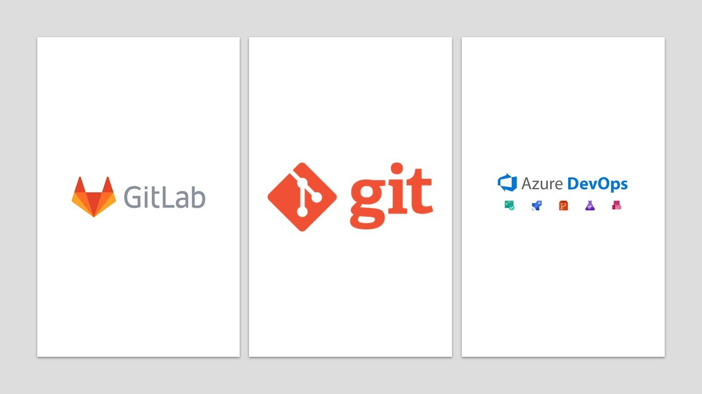
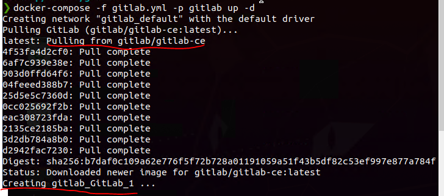
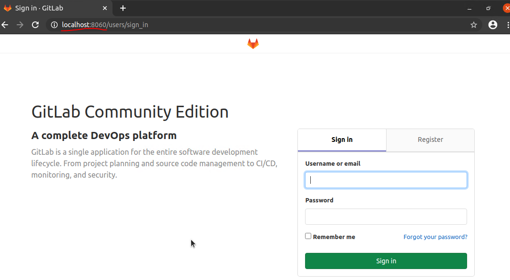
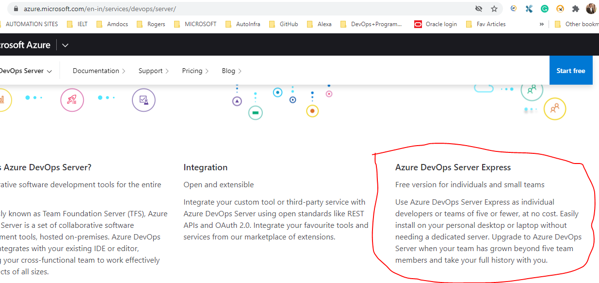

## SetUp your own On-Premise Source Code Management tools.

In this article we are going to see how to install community editions of GitLab and AzureDevops.

I have seen some of the small automation projects doesn’t afford enterprise licenses and end up with SVN like tools to manage their code. This often leads to merging problems and clear checks of PRs properly.

I recently came to Understand that Gitlab and AzureDevops has community editions and they are free to use for everyone. Not sure if everyone is aware of these editions earlier. Somehow I feel that these community editions didn't reach the amount of audience it is supposed to be. So let's start the setup process.

Pre-requisites

For GitLab:
- Docker 
- Linux VM

For Azure DevOps:

- SQL Server 
- Windows Machine [16 GB Ram with 5 GB Dedicated to AzureDevOps]
- Docker [optional if you do not want to install sql server and Run it as Container]

SetUp -1: Let's see how to install GitLab.
Save below file as docker-compose.yml and run it with command

-     docker-compose -p gitlab up -d --force-recreate --build

 Execute docker-compose -p gitlab up -d --force-recreate --build to start all containers in daemon mode
 Where:

```yml
'-f docker-compose.yml' -- specifies this compose file
      '-p reportportal' -- specifies container's prefix (project name)
      '-d' -- enables daemon mode
      '--force-recreate' -- forces re-recreating of all containers
```




```yml
version: '2.4'
services:

  GitLab:
    image: gitlab/gitlab-ce:latest
    restart: always
    hostname: 'gitlab.AutoInfra.com'
    ports:
      - "8060:80"
      - "443:443"
      - "22:22"

    volumes:
      - GitLabConfig:/etc/gitlab
      - GitLabLogss:/var/log/gitlab
      - GitLabDatavol:/var/opt/gitlab


    restart: always
    hostname: "gitlab.AutoInfra.com"
         
  # Docker volume for Windows host
volumes:
  GitLabConfig:
  GitLabLogss:
  GitLabDatavol:
```

You can modify the Volumes mapping as per your OS and requirement. I have changed the port 80 Configuration to 8060.


Now open http://localhost:8060

Note: The very first time you visit GitLab, you will be asked to set up the admin password. After you change it, you can login with username root and the password you set up.




Next Steps: Now your SCM Is Up and Running just follow the usual process of adding your repositories.

SetUp 2 : Install Azure DevOps Community Edition.
Azure Devops Community Edition called as Azure Devops Server Express. Here is what Microsoft says about it.




Download the software from [here](https://azure.microsoft.com/en-in/services/devops/server/)

Download SQL Server from Here and install it. [just like any other software installation in Windows]

Now Start Installing Azure DevOps software [ Also like usual software installation]

You can find all azure DevOps installation from [Here](https://docs.microsoft.com/azure/devops/server/install/get-started?view=azure-devops-2020)

As Azure DevOps is like usual software installation I am not writing any detailed steps, You will figure it out while Installing ;)

Happy Learning :)