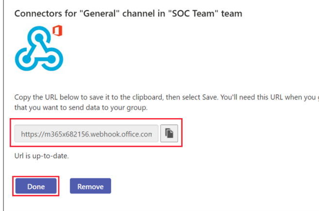
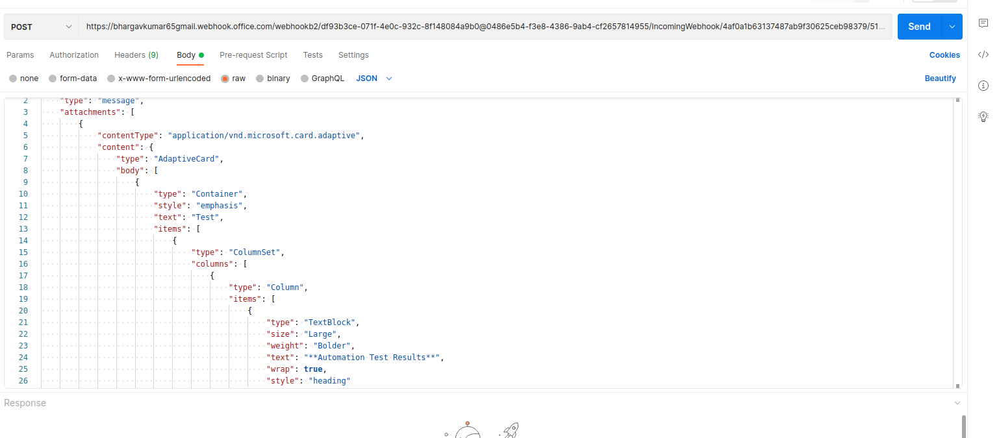
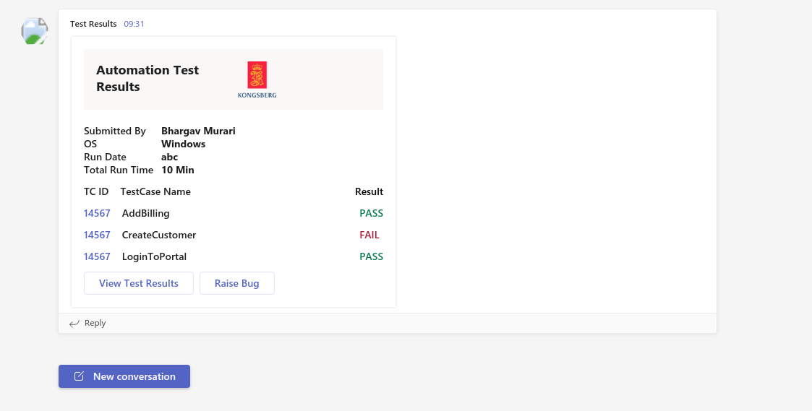

Hello Everyone,

In this article lets see how to Send Test Results to Microsoft Teams Like Below


**Pre Requisites**:
1. Microsoft Teams WebHook
2. AdaptiveCards.io knowledge (basic drag and drop)
3. Selenium / RestAssured Framework with TestNG
4. RestAssured Dependency
5. Intellij Idea (for Lombok Plugin)

**Step1**: Create a WebHook for Microsoft Teams. 

Follow this article and Create a Hook, it is very easy to create one.

At Step no.5 from Above article you will get a RestAPI Endoint which will look like below. Keep this Endpoint URL for Posting the Results.



**Step2**: Select a Design from adaptivecards

Adaptive Cards are an open card exchange format enabling developers to exchange UI content in a common and consistent way. We can choose the Design as per requirements and start updating it.'
To send Data to WebHooks we need a JSON Payload. Below is the basic Format of Request Body.

```java
{

      "type": "message", 

      "attachments": [ 

        { 

          "contentType": "application/vnd.microsoft.card.adaptive", 

          "content": <PASTE THE COPIED ADAPTIVE CARD JSON HERE> 

        }] 

}  
```
We need to Paste the Adaptive Cards JSON in the pace of "content" above.
your Entire Json Body will look like below after that

Here is the Sample Json Body we are going to implement.
Paste below Json in Postman and Beautify it for better readability.

```java
    "type": "message",
    "attachments": [
        {
            "contentType": "application/vnd.microsoft.card.adaptive",
            "content": {
                "type": "AdaptiveCard",
                "body": [
                    {
                        "type": "Container",
                        "style": "emphasis",
                        "text": "Test",
                        "items": [
                            {
                                "type": "ColumnSet",
                                "columns": [
                                    {
                                        "type": "Column",
                                        "items": [
                                            {
                                                "type": "TextBlock",
                                                "size": "Large",
                                                "weight": "Bolder",
                                                "text": "**Automation Test Results**",
                                                "wrap": true,
                                                "style": "heading"
                                            }
                                        ],
                                        "width": "stretch"
                                    },
                                    {
                                        "type": "Column",
                                        "items": [
                                            {
                                                "type": "Image",
                                                "url": "https://upload.wikimedia.org/wikipedia/en/thumb/e/ea/Kongsberg_Gruppen_logo.svg/1200px-Kongsberg_Gruppen_logo.svg.png",
                                                "altText": "Failed",
                                                "height": "50px"
                                            }
                                        ],
                                        "width": "auto"
                                    }
                                ]
                            }
                        ]
                    },
                    {
                        "type": "FactSet",
                        "spacing": "Large",
                        "facts": [
                            {
                                "title": "Submitted By",
                                "value": "**Bhargav Murari**"
                            },
                            {
                                "title": "OS",
                                "value": "**Windows**"
                            },
                            {
                                "title": "Run Date",
                                "value": "**abc**"
                            },
                            {
                                "title": "Total Run Time",
                                "value": "**asd**"
                            }
                        ]
                    },
                    {
                        "type": "Container",
                        "items": [
                            {
                                "type": "ColumnSet",
                                "columns": [
                                    {
                                        "type": "Column",
                                        "items": [
                                            {
                                                "type": "TextBlock",
                                                "text": "TC ID",
                                                "weight": "Bolder",
                                                "wrap": true
                                            }
                                        ],
                                        "width": "auto"
                                    },
                                    {
                                        "type": "Column",
                                        "spacing": "Medium",
                                        "items": [
                                            {
                                                "type": "TextBlock",
                                                "text": "Test Case Name",
                                                "weight": "Bolder",
                                                "wrap": true
                                            }
                                        ],
                                        "width": "stretch"
                                    },
                                    {
                                        "type": "Column",
                                        "items": [
                                            {
                                                "type": "TextBlock",
                                                "text": "Error",
                                                "weight": "Bolder",
                                                "color": "attention",
                                                "wrap": true
                                            }
                                        ],
                                        "width": "auto"
                                    }
                                ]
                            }
                        ]
                    },
                    {
                        "type": "Container",
                        "items": [
                            {
                                "type": "ColumnSet",
                                "columns": [
                                    {
                                        "type": "Column",
                                        "items": [
                                            {
                                                "type": "TextBlock",
                                                "text": "[14567](https://adaptivecards.io)",
                                                "wrap": true
                                            }
                                        ],
                                        "width": "auto"
                                    },
                                    {
                                        "type": "Column",
                                        "spacing": "Medium",
                                        "items": [
                                            {
                                                "type": "TextBlock",
                                                "text": "DuckDuck Go Login",
                                                "wrap": true
                                            }
                                        ],
                                        "width": "stretch"
                                    },
                                    {
                                        "type": "Column",
                                        "spacing": "Small",
                                        "selectAction": {
                                            "type": "Action.ToggleVisibility",
                                            "targetElements": [
                                                "ExceptionDetails",
                                                "chevronDown1",
                                                "chevronUp1"
                                            ]
                                        },
                                        "verticalContentAlignment": "Center",
                                        "items": [
                                            {
                                                "type": "Image",
                                                "id": "chevronDown1",
                                                "url": "https://adaptivecards.io/content/down.png",
                                                "width": "20px",
                                                "altText": "desc 12 collapsed"
                                            },
                                            {
                                                "type": "Image",
                                                "id": "chevronUp1",
                                                "url": "https://adaptivecards.io/content/up.png",
                                                "width": "20px",
                                                "altText": "description total expanded",
                                                "isVisible": false
                                            }
                                        ],
                                        "width": "auto"
                                    }
                                ]
                            }
                        ]
                    },
                    {
                        "type": "Container",
                        "id": "ExceptionDetails",
                        "isVisible": false,
                        "items": [
                            {
                                "type": "Container",
                                "items": [
                                    {
                                        "type": "TextBlock",
                                        "text": "* TestCase Error*",
                                        "isSubtle": true,
                                        "wrap": true
                                    }
                                ]
                            }
                        ]
                    },
                    {
                        "type": "Container",
                        "items": [
                            {
                                "type": "ActionSet",
                                "actions": [
                                    {
                                        "type": "Action.OpenUrl",
                                        "title": "View Test Results",
                                        "url": "https://adaptivecards.io",
                                        "style": "destructive"
                                    },
                                    {
                                        "type": "Action.OpenUrl",
                                        "title": "Raise Bug",
                                        "url": "https://adaptivecards.io",
                                        "style": "destructive"
                                    }
                                ]
                            }
                        ]
                    }
                ]
            }
        }
    ]
}
```
Now Create a POJO Class for above Json Body like below.


```java
package listeners.MicrosoftTeams

import com.fasterxml.jackson.annotation.JsonInclude;
import lombok.Builder;
import lombok.Data;

import java.util.List;

@Data
@Builder
@JsonInclude(JsonInclude.Include.NON_NULL)
public class AdaptiveCardReqBody{
   private List<AttachmentsItem> attachments;
   private String type;

   @Data
   @Builder
   public static class ActionsItem{
      private String style;
      private String type;
      private String title;
      private String url;
   }

   @Data
   @Builder
   @JsonInclude(JsonInclude.Include.NON_NULL)
   public static class AttachmentsItem{
      private String contentType;
      private Content content;
   }

   @Data
   @Builder
   @JsonInclude(JsonInclude.Include.NON_NULL)
   public static class BodyItem{
      private String type;
      private List<ItemsItem> items;
      private String id;
      private boolean isVisible;
      private String spacing;
      private List<FactsItem> facts;
      private String style;
      private String text;
   }

   @Data
   @Builder
   @JsonInclude(JsonInclude.Include.NON_NULL)
   public  static class ColumnsItem{
      private String width;
      private String type;
      private List<ItemsItem> items;
      private String spacing;
      private String verticalContentAlignment;
      private SelectAction selectAction;
   }

   @Data
   @Builder
   @JsonInclude(JsonInclude.Include.NON_NULL)
   public static class Content{
      private String type;
      private List<BodyItem> body;
   }

   @Data
   @Builder
   @JsonInclude(JsonInclude.Include.NON_NULL)
   public static class FactsItem{
      private String title;
      private String value;
   }

   @Data
   @Builder
   @JsonInclude(JsonInclude.Include.NON_NULL)
   public static class ItemsItem{
      private List<ColumnsItem> columns;
      private String type;
      private String size;
      private String weight;
      private String style;
      private String text;
      private boolean wrap;
      private String altText;
      private String url;
      private String height;
      private String color;
      private String width;
      private String id;
      private boolean isVisible;
      private List<ItemsItem> items;
      private String data;
      private boolean isSubtle;
      private List<ActionsItem> actions;
   }

   @Data
   @Builder
   @JsonInclude(JsonInclude.Include.NON_NULL)
   public static class SelectAction{
      private List<String> targetElements;
      private String type;
   }
};
```

Now Implement the Builder Class to Add Data

```java
package listeners.MicrosoftTeams

import java.util.Arrays;
import java.util.List;

import static listeners.MicrosoftTeams.AdaptiveCardReqBody.*;

public class Builder {

    List<ItemsItem> TestCaseName;
    List<ItemsItem> TestCaseID;
    List<ItemsItem> TestResult;

    public Builder(List<ItemsItem> testCaseName, List<ItemsItem> testCaseID, List<ItemsItem> testResult) {
        TestCaseName = testCaseName;
        TestCaseID=testCaseID;
        TestResult=testResult;

    }

    public AdaptiveCardReqBody reqBody(){
        return builder()
                .type("message")
                .attachments(Arrays.asList(attachments()))
                .build();
    }

    public AttachmentsItem attachments(){

        return  AttachmentsItem.builder()
                .content(content())
                .contentType("application/vnd.microsoft.card.adaptive").build();

    }

    public Content content(){
        return Content.builder()
                .type("AdaptiveCard")
                .body(Arrays.asList(banner(),factSetBody(),headings(),testcases(), buttons()))
                .build();
    }

    public BodyItem banner(){

        ItemsItem itemsItem1 = ItemsItem.builder()
                .type("TextBlock")
                .size("Large")
                .weight("Bolder")
                .text("**Automation Test Results**")
                .wrap(true)
                .style("heading")
                .build();

        ItemsItem itemsItem2 = ItemsItem.builder()
                .type("Image")
                .url("https://upload.wikimedia.org/wikipedia/en/thumb/e/ea/Kongsberg_Gruppen_logo.svg/1200px-Kongsberg_Gruppen_logo.svg.png")
                .altText("Failed")
                .height("50px")
                .build();

        ColumnsItem columnsItem1 = ColumnsItem.builder()
                .type("Column")
                .width("stretch")
                .items(Arrays.asList(itemsItem1)).build();

        ColumnsItem columnsItem2 = ColumnsItem.builder()
                .type("Column")
                .width("stretch")
                .items(Arrays.asList(itemsItem2)).build();


        ItemsItem itemsItem = ItemsItem.builder()
                .type("ColumnSet")
                .columns(Arrays.asList(columnsItem1,columnsItem2)).build();

       return  BodyItem.builder()
                .type("Container")
                .style("emphasis")
                .text("Test")
                .items(Arrays.asList(itemsItem))
                .build();


    }

    public BodyItem factSetBody(){

        FactsItem fact1 = FactsItem
                .builder()
                .title("Submitted By")
                .value( "**Bhargav Murari**").build();

        FactsItem fact2 = FactsItem
                .builder()
                .title("OS")
                .value("**Windows**").build();

        FactsItem fact3 = FactsItem
                .builder()
                .title("Run Date")
                .value("**abc**").build();

        FactsItem fact4 = FactsItem
                .builder()
                .title("Total Run Time")
                .value("**10 Min**").build();

        return  BodyItem.builder()
                .type("FactSet")
                .spacing("Large")
                .facts(Arrays.asList(fact1,fact2,fact3,fact4))
                .build();
    }

    public BodyItem headings(){
        ItemsItem itemsItem1 = ItemsItem.builder()
                .type("TextBlock")
                .text("TC ID")
                .weight("Bolder")
                .wrap(true)
                .build();

        ItemsItem itemsItem2 = ItemsItem.builder()
                .type("TextBlock")
                .text("TestCase Name")
                .weight("Bolder")
                .wrap(true)
                .build();

        ItemsItem itemsItem3 = ItemsItem.builder()
                .type("TextBlock")
                .text("Result")
                .weight("Bolder")
                .color("dark")
                .wrap(true)
                .build();

        ColumnsItem columnsItem1 = ColumnsItem.builder()
                .type("Column")
                .items(Arrays.asList(itemsItem1))
                .width("auto").build();

        ColumnsItem columnsItem2 = ColumnsItem.builder()
                .type("Column")
                .spacing("medium")
                .items(Arrays.asList(itemsItem2))
                .width("stretch").build();

        ColumnsItem columnsItem3 = ColumnsItem.builder()
                .type("Column")
                .items(Arrays.asList(itemsItem3))
                .width("auto").build();

        ItemsItem itemsItem = ItemsItem.builder()
                .type("ColumnSet")
                .columns(Arrays.asList(columnsItem1,columnsItem2,columnsItem3))
                .build();

        return  BodyItem.builder()
                .type("Container")
                .items(Arrays.asList(itemsItem))
                .build();
    }

    public BodyItem testcases(){

/*        ItemsItem testCaseID = ItemsItem.builder()
                .type("TextBlock")
                .text("[14567](https://adaptivecards.io)")
                .weight("Bolder")
                .wrap(true)
                .build();*/

/*        ItemsItem testCaseName = ItemsItem.builder()
                .type("TextBlock")
                .text("TestCase Description")
                .weight("Bolder")
                .wrap(true)
                .build();*/
/*

        ItemsItem itemsItemcol3 = ItemsItem.builder()
                .type("TextBlock")
                .text("Failed")
                .weight("Bolder")
                .color("attention")
                .wrap(true)
                .build();
*/


        ColumnsItem columnsItem1 = ColumnsItem.builder()
                .type("Column")
                .items(TestCaseID)
                .width("auto").build();

        ColumnsItem columnsItem2 = ColumnsItem.builder()
                .type("Column")
                .spacing("medium")
                .items(TestCaseName)
                .width("stretch").build();

        ColumnsItem columnsItem33 = ColumnsItem.builder()
                .type("Column")
                .spacing("medium")
                .items(TestResult)
                .width("auto").build();


        ItemsItem itemsItem = ItemsItem.builder()
                .type("ColumnSet").columns(Arrays.asList(columnsItem1,columnsItem2,columnsItem33)).build();

        return BodyItem.builder().type("Container")
                .items(Arrays.asList(itemsItem)).build();
    }

    public BodyItem errorDetails(){

        ItemsItem itemsItem1 = ItemsItem.builder()
                .type("TextBlock")
                .text("Error Details")
                .isSubtle(true)
                .wrap(true)
                .build();
ItemsItem itemsItem2 = ItemsItem.builder()
        .type("Container").items(Arrays.asList(itemsItem1)).build();

        return  BodyItem.builder()
                .type("Container")
                .id("ExceptionDetails")
                .isVisible(false)
                .items(Arrays.asList(itemsItem2))
                .build();
    }

    public BodyItem buttons(){
        ActionsItem actionsItem1 = ActionsItem.builder()
                .title("View Test Results")
                .type("Action.OpenUrl")
                .url("https://adaptivecards.io")
                .style("destructive")
                .build();

        ActionsItem actionsItem2 = ActionsItem.builder()
                .title("Raise Bug")
                .type("Action.OpenUrl")
                .url("https://adaptivecards.io")
                .style("destructive")
                .build();

        ItemsItem itemsItem = ItemsItem.builder()
                .type("ActionSet")
                .actions(Arrays.asList(actionsItem1,actionsItem2)).build();

        return  BodyItem.builder()
                .type("Container")
                //.isVisible(false)
                .items(Arrays.asList(itemsItem))
                .build();
    }


    public void arrows(){
        ////Column3
        SelectAction selectAction = SelectAction.builder().type("Action.ToggleVisibility")
                .targetElements(Arrays.asList("ExceptionDetails", "chevronDown1", "chevronUp1")).build();

        ItemsItem itemsItem3 = ItemsItem.builder()
                .type("Image")
                .id("chevronDown1")
                .url("https://adaptivecards.io/content/down.png")
                .width("20px")
                .altText("desc 12 collapsed").build();

        ItemsItem itemsItem4 = ItemsItem.builder()
                .type("Image")
                .id("chevronUp1")
                .url("https://adaptivecards.io/content/up.png")
                .width("20px")
                .isVisible(false)
                .altText("description total expanded").build();

        ColumnsItem columnsItem3 = ColumnsItem.builder()
                .type("Column")
                .spacing("Small")
                .selectAction(selectAction)
                .verticalContentAlignment("Center")
                .items(Arrays.asList(itemsItem3,itemsItem4))
                .width("auto").build();

    }
}

```
At Last Listener Class to send Results on Finish.

```java
package listeners.MicrosoftTeams

import io.restassured.RestAssured;
import org.testng.ISuite;
import org.testng.ISuiteListener;
import org.testng.ITestListener;
import org.testng.ITestResult;

import java.util.ArrayList;
import java.util.List;

import static listeners.MicrosoftTeams.AdaptiveCardReqBody.*;

public class Listener implements ITestListener, ISuiteListener{

    List<ItemsItem> TestCaseID = new ArrayList<>();
    List<ItemsItem> TestCaseName = new ArrayList<>();
    List<ItemsItem> TestResult = new ArrayList<>();

    @Override
    public void onTestStart(ITestResult result) {
        TestCaseName.add(ItemsItem.builder()
                .type("TextBlock")
                .text(result.getMethod().getMethodName())
                .weight("Bolder")
                .wrap(true)
                .build());


        TestCaseID.add(ItemsItem.builder()
                .type("TextBlock")
                .text("[14567](https://adaptivecards.io)")
                .weight("Bolder")
                .wrap(true)
                .build());
    }

    @Override
    public void onTestSuccess(ITestResult result) {


        TestResult.add(ItemsItem.builder()
                .type("TextBlock")
                .text("PASS")
                .weight("Bolder")
                .color("good")
                .wrap(true)
                .build());
    }

    @Override
    public void onTestFailure(ITestResult result) {


        TestResult.add(ItemsItem.builder()
                .type("TextBlock")
                .text("FAIL")
                .weight("Bolder")
                .color("attention")
                .wrap(true)
                .build());
    }

    @Override
    public void onFinish(ISuite suite) {

        Builder builder = new Builder(TestCaseName,TestCaseID,TestResult);

        RestAssured.baseURI="YOUR WEBHOOK URL";
        RestAssured.given().log().body()
                .body(builder.reqBody())
                .when()
                .post()
                .then().log().body()
                .statusCode(200);
    }

}
```
Now add the Above TestNG Listener in your TestNG XML File and Run the testcases

```java
<listeners>

 <listener class-name="listeners.MicrosoftTeams.Listener"></listener>

</listeners>

```
After the Execution you will see your Test Results like below.



Note: AdaptiveCards.io is highly customizable as per our Needs, if you are a RestAssured or Pojo Expert I would like to work on Enhancing the above card with more features.
Enjoy...
