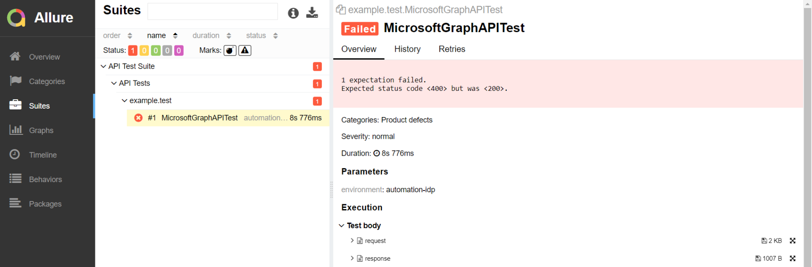
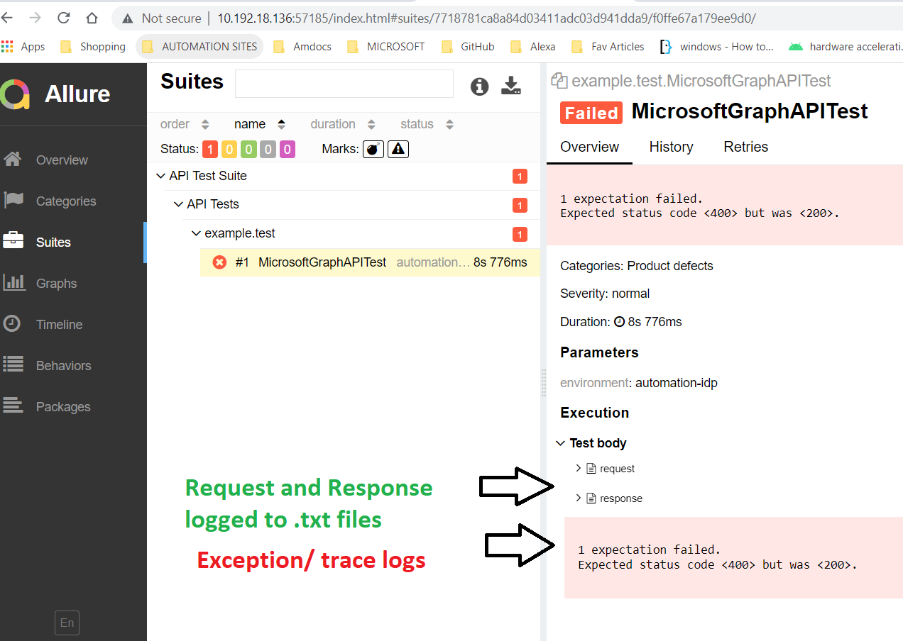
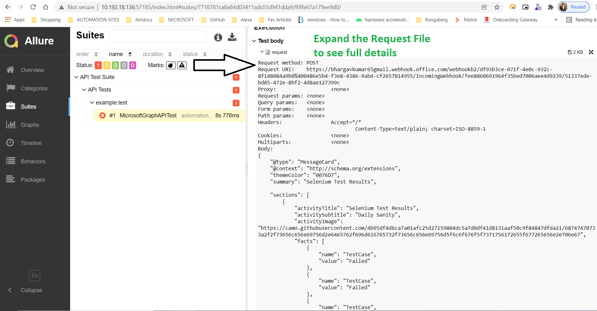
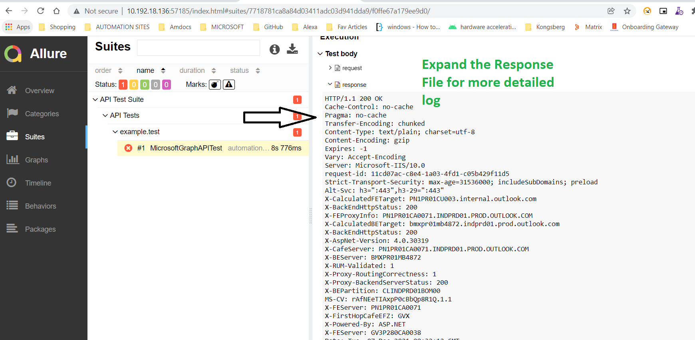

Goal: Record API Request and Response using RestAssured Logging with Minimal Coding, By Decreasing the Boiler Plate code for Reporting Purposes.
Libraries in Use:
1. RestAssured
2. AllureReports
3. TestNG

Step1: Create a TestNG Listener Class as Below.
```java

public class AllureListener implements ITestListener, IInvokedMethodListener,IInvokedMethodListener {
    private ByteArrayOutputStream request = new ByteArrayOutputStream();
    private  ByteArrayOutputStream response = new ByteArrayOutputStream();
    private PrintStream requestVar = new PrintStream(request,true);
    private PrintStream responseVar = new PrintStream(response,true);

    @SneakyThrows
    @Override
    public void afterInvocation(IInvokedMethod method, ITestResult testResult) {
        IInvokedMethodListener.super.afterInvocation(method, testResult);
          logRequest(request);
        logResponse(response);
    }

    @Attachment(value = "request", type = "text/plain")
    public byte[] logRequest(final ByteArrayOutputStream stream) {
        return attach(stream);
    }

    @Attachment(value = "response", type = "text/plain")
    public byte[] logResponse(final ByteArrayOutputStream stream) {
        return attach(stream);
    }

    public byte[] attach(final ByteArrayOutputStream log) {
        final byte[] array=log.toByteArray();
        log.reset();
        return array;
    }

	@Override
	public void onStart(ISuite suite) {
		ISuiteListener.super.onStart(suite);
		RestAssured.filters(new RequestLoggingFilter(LogDetail.ALL, requestVar), new ResponseLoggingFilter(LogDetail.ALL, responseVar));
	}

	@Override
	public void onFinish(ISuite suite) {
		ISuiteListener.super.onFinish(suite);
		RestAssured.reset();
	}

}

```
### Explanation of above code:

From the above TestNG Listener class we are initializing two types of Variables.

1. ByteArrayOutPutStream
2. PrintArrayStream

```java
    private ByteArrayOutputStream request = new ByteArrayOutputStream();
    private  ByteArrayOutputStream response = new ByteArrayOutputStream();
    private PrintStream requestVar = new PrintStream(request,true);
    private PrintStream responseVar = new PrintStream(response,true);
```

After the Variables declaration I am adding request and response methods for allure to send the Logs with annotation @Attachment
```
@Attachment(value = "request", type = "text/plain")
    public byte[] logRequest(final ByteArrayOutputStream stream) {
        return attach(stream);
    }

    @Attachment(value = "response", type = "text/plain")
    public byte[] logResponse(final ByteArrayOutputStream stream) {
        return attach(stream);
    }

```

And in OnStart Method from ItestSuite we are defining the RestAssured LoggingLevel. by Using RestAssured.Filters and RequestLoggingFiler

```java
	@Override
	public void onStart(ISuite suite) {
		ISuiteListener.super.onStart(suite);
		RestAssured.filters(new RequestLoggingFilter(LogDetail.ALL, requestVar), new ResponseLoggingFilter(LogDetail.ALL, responseVar));
	}
```

After OnStart the execution will go to AfterInvoke method, this is where the Logs get pushed to Allure.

```java
public void afterInvocation(IInvokedMethod method, ITestResult testResult) {
        IInvokedMethodListener.super.afterInvocation(method, testResult);
          logRequest(request);
        logResponse(response);
    }
```
At the end of Test Suite we are Resetting the RestAssured as RestAssured.reset() to avoid duplicate logging.

```java
@Override
	public void onFinish(ISuite suite) {
		ISuiteListener.super.onFinish(suite);
		RestAssured.reset();
	}
```

Thats it, Add the Above Listener to your TestNG xml and check the Report. Your Report will look like below.





