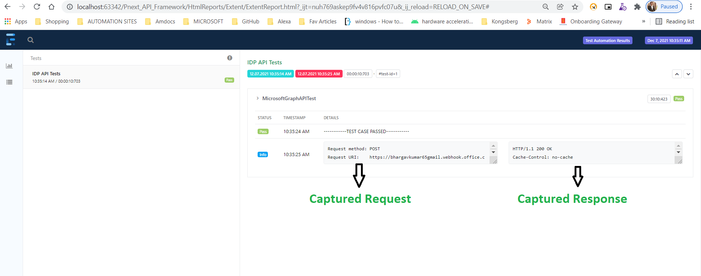
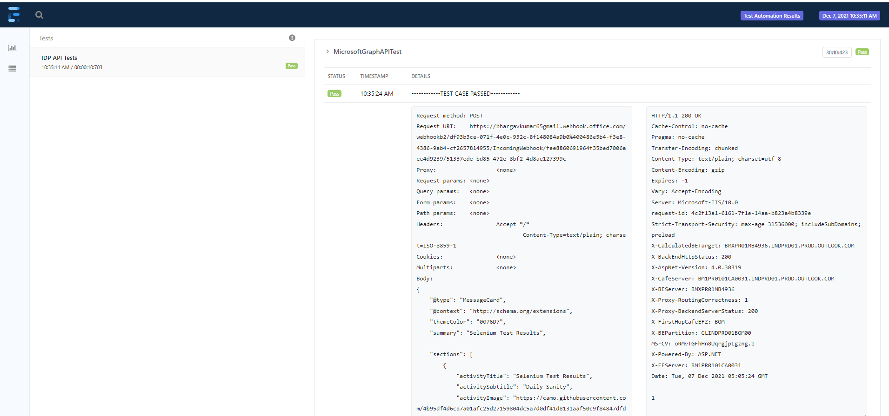
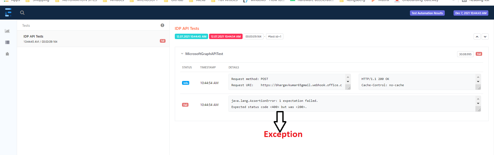

Goal: Record API Request and Response using RestAssured Logging with Minimal Coding, By Decreasing the Boiler Plate code for Reporting Purposes.
Libraries in Use:
1. RestAssured
2. ExtentReports
3. TestNG


Step1: Create a ExtentReport Class for ExtentSparkReporter class initialization.

```Java
public class ExtentReporterCls {
    static ExtentReports extent;

    public static ExtentReports ReportGenerator()
    {
        Date d = new Date();
        SimpleDateFormat SDF = new SimpleDateFormat("yyyy-MMM-dd_HH_mm");

        String path = System.getProperty("user.dir")+"\\HtmlReports\\Extent\\"+"ExtentReport.html";

        ExtentSparkReporter ESR = new ExtentSparkReporter(path).viewConfigurer()
                .viewOrder()
                .as(new ViewName[] { ViewName.DASHBOARD, ViewName.TEST, ViewName.EXCEPTION,ViewName.LOG  })
                .apply();
        ESR.config().setReportName("Test Automation Results");
       // ESR.config().setDocumentTitle("Test Results");
        extent = new ExtentReports();
        extent.attachReporter(ESR);
        extent.setSystemInfo("Tester",System.getProperty("user.name"));
        return extent;

    }

}
```
Step2: Create a TestNG Listener Class as Below.

```Java
public class ExtentListener implements ITestListener, ISuiteListener,IInvokedMethodListener {
    ExtentReports extent = ExtentReporterCls.ReportGenerator();
    ExtentTest test;
    ExtentTest node;
    private ByteArrayOutputStream request = new ByteArrayOutputStream();
    private  ByteArrayOutputStream response = new ByteArrayOutputStream();
    private PrintStream requestVar = new PrintStream(request,true);
    private PrintStream responseVar = new PrintStream(response,true);

    private static final ThreadLocal<ExtentTest> LocalThread = new ThreadLocal<ExtentTest>();

    public void logInfo(String message)
    {
        LocalThread.get().info(message);
    }

    public void logJsoninfo(String json)
    {
        LocalThread.get().info(MarkupHelper.createCodeBlock(json, CodeLanguage.JSON));
    }

    public void logReqAndResponse(String json1,String json2)
    {
        LocalThread.get().info(MarkupHelper.createCodeBlocks(new String[]{json1, json2}));
    }

    @Override
    public void onTestStart(ITestResult result) {
        node = test.createNode(result.getMethod().getMethodName());
        LocalThread.set(node);
    }

    @Override
    public void onTestSuccess(ITestResult result) {
        LocalThread.get().log(Status.PASS,"------------TEST CASE PASSED------------");
        LocalThread.get().info(MarkupHelper.createCodeBlocks(new String[]{request.toString().trim(),response.toString().trim()}));
    }

    @Override
    public void onTestFailure(ITestResult result) {
        LocalThread.get().info(MarkupHelper.createCodeBlocks(new String[]{request.toString().trim(), response.toString().trim()}));
        LocalThread.get().fail(result.getThrowable());
    }

    @Override
    public void onTestSkipped(ITestResult result) {
        LocalThread.get().log(Status.INFO,"------------TEST CASE SKIPPED------------");
        LocalThread.get().skip(result.getThrowable());

    }

	@Override
	public void onStart(ISuite suite) {
		ISuiteListener.super.onStart(suite);
		RestAssured.filters(new RequestLoggingFilter(LogDetail.ALL, requestVar), new ResponseLoggingFilter(LogDetail.ALL, responseVar));
	}

	@Override
	public void onFinish(ISuite suite) {
		ISuiteListener.super.onFinish(suite);
		RestAssured.reset();
	}

    @SneakyThrows
    @Override
    public void onFinish(ITestContext context) {
        extent.flush();
    }
}
```
### Explanation of above code:


From the above TestNG Listener class we are initializing two types of Variables.

1. ByteArrayOutPutStream
2. PrintArrayStream

```Java
    private ByteArrayOutputStream request = new ByteArrayOutputStream();
    private  ByteArrayOutputStream response = new ByteArrayOutputStream();
    private PrintStream requestVar = new PrintStream(request,true);
    private PrintStream responseVar = new PrintStream(response,true);
```

And in OnStart Method we are defining the RestAssured LoggingLevel. by Using RestAssured.Filters and RequestLoggingFiler

```Java
 public void onStart(ITestContext context) {

        RestAssured.filters(new RequestLoggingFilter(LogDetail.ALL,requestVar),new ResponseLoggingFilter(LogDetail.ALL,responseVar));
        test= extent.createTest(context.getName());
    }

```

At the end of Test Suite we are Resetting the RestAssured as RestAssured.reset() to avoid duplicate logging.
```java
@Override
	public void onFinish(ISuite suite) {
		ISuiteListener.super.onFinish(suite);
		RestAssured.reset();
	}
```    

Add the Above Listener to your TestNG xml and check the Report. Your Report will look like below.





