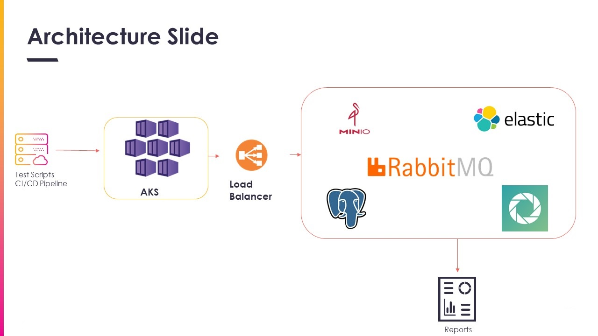
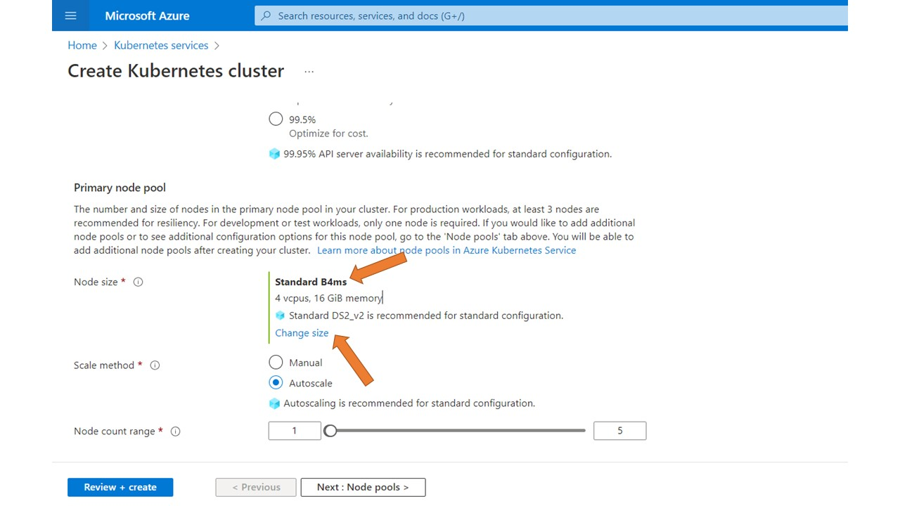
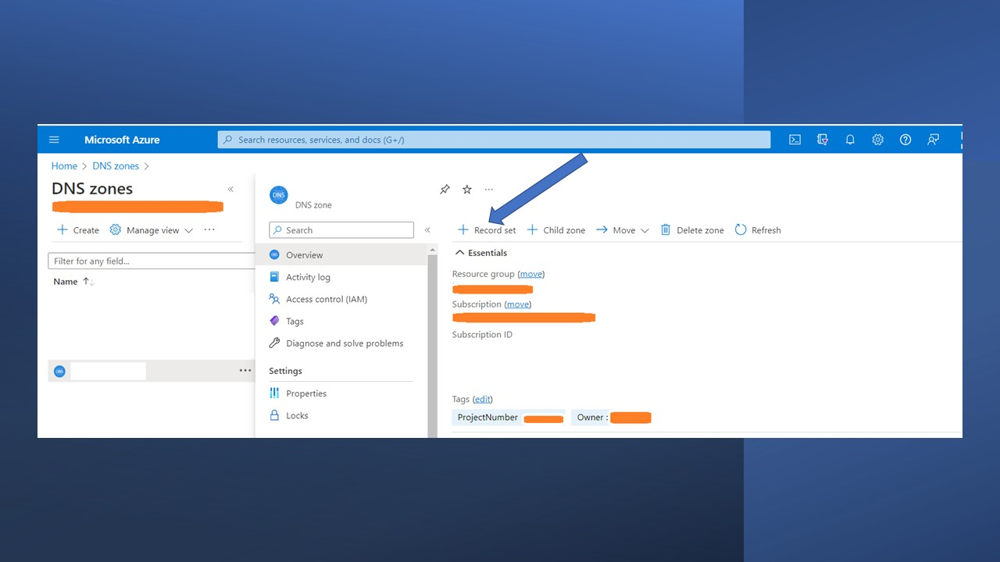
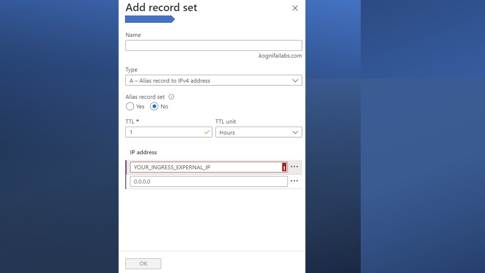

# Deploy Reportportal.io on Azure Kubernetes Service

This Article is Written as a part of Kongsberg Digital Blogging Challange.

#KdiBloggingChallange #articleAWeek #KongsbergTechCommunity

Couple of years ago i have written my first article on [How to deploy Reportportal on Dockers](https://autoinfra.github.io/home/docs/Articles/ReportPortal), Now it is time for Kubernetes

### Overall information

#### Basic Deployment Architecture:



This project is created to install ReportPortal on Kubernetes with Helm. I have faced many issues while following the Official Documentation and for a novice Kubernetes guys it is very difficult to understand the deployement steps.

In this articles i am describing installation of all mandatory services to run the application such as PostgreSQL, elasticsearch,Minio and RabbitMQ.

### PreRequisites:
* Aks Cluster 
* Helm

> Create a AKS Cluster

The Azure Kubernetes Service (AKS) offers simple deployments for Kubernetes clusters.

To deploy an AKS cluster use the following guides:
- [By using the Azure portal](https://docs.microsoft.com/en-us/azure/aks/kubernetes-walkthrough-portal)
- [By using the Azure CLI](https://docs.microsoft.com/en-us/azure/aks/kubernetes-walkthrough)

:::tip NodeSize and No.of Nodes to select

While creating AKS cluster it is recomended to select a 16 GB Ram node and 100+ GB disk space for your Node.
I have selected Standard_B4ms for my requirements

:::


#### ReportPortal use the following images:

- [`service-authorization`](https://github.com/reportportal/service-authorization) Authorization Service. In charge of access tokens distribution
- [`service-api`](https://github.com/reportportal/service-api) API Service. Application Backend
- [`service-ui`](https://github.com/reportportal/service-ui) UI Service. Application Frontend
- [`service-analyzer`](https://github.com/reportportal/service-auto-analyzer) Analyzer Service. Finds most relevant test fail prob

#### Other Images we are going to need (non managed by ReportPortal team):
- `RabbitMQ` (Helm chart installation)
- `ElasticSearch` (Helm chart installation | Amazon Elasticsearch Service)
- `PostgreSQL` (Helm chart installation | Amazon PostgreSQL RDS | Azure Database for PostgreSQL)
- `MinIO` (Helm chart installation)

All configuration variables are presented in `values.yaml` file.

> Install and configure Helm package manager

Note: Helm is installed by default when you create AKS Cluster, if Helm is not created then use the following:

- [Install Helm On Azure](https://docs.microsoft.com/en-us/azure/aks/kubernetes-helm)

Confirm that Helm is running with the following command
```
helm version
```

#### Deploy NGINX Ingress controller

Please find the guides below:

- [NGNIX ON AZURE](https://github.com/kubernetes/ingress-nginx/blob/master/docs/deploy/index.md#azure)

Or you can istall an NGINX ingress controller using Helm.

```
helm repo add ingress-nginx https://kubernetes.github.io/ingress-nginx && helm repo update

```

##### Now Our AKS Cluster is ready, Lets move forward with the Deployment steps

#### Step1: Download the Latest ReportPortal Kubernetes Files.
```
helm repo add rp_repo https://reportportal.github.io/kubernetes

helm pull rp_repo/reportportal –untar

```

#### Step2:  Update HELM dependency with reportportal

Run Command ```helm dependency update reportportal```

Once you run above command, output Should be something like this:

``` 
Getting updates for unmanaged Helm repositories...
...Successfully got an update from the "https://raw.githubusercontent.com/bitnami/charts/archive-full-index/bitnami" chart repository
...Successfully got an update from the "https://raw.githubusercontent.com/bitnami/charts/archive-full-index/bitnami" chart repository
...Successfully got an update from the "https://raw.githubusercontent.com/bitnami/charts/archive-full-index/bitnami" chart repository
Hang tight while we grab the latest from your chart repositories...
...Successfully got an update from the "rp_repo" chart repository
...Successfully got an update from the "elastic" chart repository
...Successfully got an update from the "ingress-nginx" chart repository
...Successfully got an update from the "bitnami" chart repository
Update Complete. ⎈Happy Helming!⎈
Saving 4 charts
Downloading postgresql from repo https://raw.githubusercontent.com/bitnami/charts/archive-full-index/bitnami
Downloading rabbitmq from repo https://raw.githubusercontent.com/bitnami/charts/archive-full-index/bitnami
Downloading elasticsearch from repo https://helm.elastic.co
Downloading minio from repo https://raw.githubusercontent.com/bitnami/charts/archive-full-index/bitnami
Deleting outdated charts 
```

#### Step3: Install NGNIX-INGRESS Latest Version

Run Command ```helm install nginx-ingress ingress-nginx/ingress-nginx --version 4.3.0```

Once you run above command, output Should be something like this:
```
NAME: nginx-ingress
LAST DEPLOYED: Sat Oct 22 13:13:36 2022
NAMESPACE: default
STATUS: deployed
REVISION: 1
TEST SUITE: None
NOTES:
The ingress-nginx controller has been installed.
It may take a few minutes for the LoadBalancer IP to be available.
You can watch the status by running 'kubectl --namespace default get services -o wide -w nginx-ingress-ingress-nginx-controller'

An example Ingress that makes use of the controller:
  apiVersion: networking.k8s.io/v1
  kind: Ingress
  metadata:
    name: example
    namespace: foo
  spec:
    ingressClassName: nginx
    rules:
      - host: www.example.com
        http:
          paths:
            - pathType: Prefix
              backend:
                service:
                  name: exampleService
                  port:
                    number: 80
              path: /
    # This section is only required if TLS is to be enabled for the Ingress
    tls:
      - hosts:
        - www.example.com
        secretName: example-tls

If TLS is enabled for the Ingress, a Secret containing the certificate and key must also be provided:

  apiVersion: v1
  kind: Secret
  metadata:
    name: example-tls
    namespace: foo
  data:
    tls.crt: <base64 encoded cert>
    tls.key: <base64 encoded
```
	
#### Step4: Install ElasticSearch 

Run command ```helm install elastic ./reportportal/charts/elasticsearch-7.10.2.tgz --set replicas=1```

If you get any errors then Run these commands 

``` helm repo add elastic https://helm.elastic.co && helm repo update 

helm dependency build ./reportportal/
helm install elastic ./reportportal/charts/elasticsearch-7.10.2.tgz --set replicas=1
```

Once you run above command, output Should be something like this:
```
W1022 13:16:07.760393   17116 warnings.go:70] policy/v1beta1 PodDisruptionBudget is deprecated in v1.21+, unavailable in v1.25+; use policy/v1 PodDisruptionB
udget
W1022 13:16:07.865213   17116 warnings.go:70] policy/v1beta1 PodDisruptionBudget is deprecated in v1.21+, unavailable in v1.25+; use policy/v1 PodDisruptionB
udget
NAME: elastic
LAST DEPLOYED: Sat Oct 22 13:16:07 2022
NAMESPACE: default
STATUS: deployed
REVISION: 1
NOTES:
1. Watch all cluster members come up.
  $ kubectl get pods --namespace=default -l app=elasticsearch-master -w
2. Test cluster health using Helm test.
  $ helm test elastic
```
#### Step5: Install rabbitmq 

``` helm install rabbit --set auth.username=rabbitmq,auth.password=rabbitmq,replicaCount=1 ./reportportal/charts/rabbitmq-7.5.6.tgz

kubectl exec -it rabbitmq-0 -- rabbitmqctl set_vm_memory_high_watermark 0.8
 ```
 
#### STEP6: Install Postgres 

``` helm install postgres \
  --set postgresqlUsername=rpuser,postgresqlPassword=rppass,postgresqlDatabase=reportportal,postgresqlPostgresPassword=rppass \
  -f ./reportportal/postgresql/values.yaml \
  ./reportportal/charts/postgresql-10.9.4.tgz
  
 ```

Once you run above command, output Should be something like this:
```  
NAME: postgres
LAST DEPLOYED: Sat Oct 22 13:17:51 2022
NAMESPACE: default
STATUS: deployed
REVISION: 1
TEST SUITE: None
NOTES:
** Please be patient while the chart is being deployed **

PostgreSQL can be accessed via port 5432 on the following DNS names from within your cluster:

    postgres-postgresql.default.svc.cluster.local - Read/Write connection

To get the password for "postgres" run:

    export POSTGRES_ADMIN_PASSWORD=$(kubectl get secret --namespace default postgres-postgresql -o jsonpath="{.data.postgresql-postgres-password}" | base64 -
-decode)

To get the password for "rpuser" run:

    export POSTGRES_PASSWORD=$(kubectl get secret --namespace default postgres-postgresql -o jsonpath="{.data.postgresql-password}" | base64 --decode)

To connect to your database run the following command:

    kubectl run postgres-postgresql-client --rm --tty -i --restart='Never' --namespace default --image docker.io/bitnami/postgresql:11.13.0-debian-10-r12 --e
nv="PGPASSWORD=$POSTGRES_PASSWORD" --command -- psql --host postgres-postgresql -U rpuser -d reportportal -p 5432

To connect to your database from outside the cluster execute the following commands:

    kubectl port-forward --namespace default svc/postgres-postgresql 5432:5432 &
    PGPASSWORD="$POSTGRES_PASSWORD" psql --host 127.0.0.1 -U rpuser -d reportportal -p 5432
```

#### Step7: Install Minio 

``` helm install minio --set accessKey.password=minio,secretKey.password=miniominio,persistence.size=40Gi ./reportportal/charts/minio-7.1.9.tgz ```

Once you run above command, output Should be something like this:
```	
NAME: minio
LAST DEPLOYED: Sat Oct 22 13:18:38 2022
NAMESPACE: default
STATUS: deployed
REVISION: 1
TEST SUITE: None
NOTES:
** Please be patient while the chart is being deployed **

MinIO&reg; can be accessed via port 9000 on the following DNS name from within your cluster:

   minio.default.svc.cluster.local

To get your credentials run:

   export ACCESS_KEY=$(kubectl get secret --namespace default minio -o jsonpath="{.data.access-key}" | base64 --decode)
   export SECRET_KEY=$(kubectl get secret --namespace default minio -o jsonpath="{.data.secret-key}" | base64 --decode)

To connect to your MinIO&reg; server using a client:

- Run a MinIO&reg; Client pod and append the desired command (e.g. 'admin info'):

   kubectl run --namespace default minio-client \
     --rm --tty -i --restart='Never' \
     --env MINIO_SERVER_ACCESS_KEY=$ACCESS_KEY \
     --env MINIO_SERVER_SECRET_KEY=$SECRET_KEY \
     --env MINIO_SERVER_HOST=minio \
     --image docker.io/bitnami/minio-client:2021.7.27-debian-10-r26 -- admin info minio

To access the MinIO&reg; web UI:

- Get the MinIO&reg; URL:

   echo "MinIO&reg; web URL: http://127.0.0.1:9000/minio"
   kubectl port-forward --namespace default svc/minio 9000:9000	
```   

#### Step8: [Optional] Package Reportportal: ``` helm package ./reportportal/ ```
   
#### Step9: Install reportportal 

```helm install reportportal \
  --set postgresql.SecretName=postgres-postgresql,postgresql.endpoint.address=postgres-postgresql.default.svc.cluster.local \
  --set rabbitmq.SecretName=rabbit-rabbitmq,rabbitmq.endpoint.address=rabbit-rabbitmq.default.svc.cluster.local \
  --set minio.secretName=minio,minio.endpoint=http://minio.default.svc.cluster.local:9000,minio.endpointshort=minio.default.svc.cluster.local:9000 \
  ./reportportal
```
Once you run above command, output Should be something like this:
```log
NAME: reportportal
LAST DEPLOYED: Sat Oct 22 13:19:37 2022
NAMESPACE: default
STATUS: deployed
REVISION: 1
TEST SUITE: None
NOTES:
ReportPortal is now available at:
    - reportportal.k8.com
```

#### Hola! Your reportportal is now Ready.

#### Step 10: Validate the pods and service

Once ReportPortal is deployed, you can validate if the application is up and running by:

1. Check the pods status:

```sh
kubectl get pods
```

Everything should be in "Running" status, and 'migrations' service in "Completed"

2. Open your LoadBalancer address in a web browser

Since you expose your application with an Ingress controller, note LoadBalancer's EXTERNAL-IP address by run:

```sh
kubectl get service
```

As an example, if you have:
```sh
my-nginx-nginx-ingress-controller  LoadBalancer 10.100.69.32  128.245.232.2342342  80:32633/TCP,443:31683/TCP  2s
```

Then http://128.245.232.2342342/ui is your Reportportal UI address

#### Step 11: Start work with ReportPortal

Open the http://<LoadBalancer's EXTERNAL-IP address> page in your browser. Defalut login and password are:

```
superadmin
erebus
```

P.S: If you can't login - please check logs of api and uat pods. It take some time to initialize

### Run ReportPortal over SSL (HTTPS)

#### 1. Configure a custom domain name for your ReportPortal website

Set up a domain name you own at the domain registrar Or if your Organization has a DNS Zone in Azure, Create a record set like Below.




#### 2. Pre-requisite configuration

In order to enable HTTPS, you need to get a SSL/TLS certificate from a Certificate Authority (CA)
As a free option, you can use Let's Encrypt - a non-profit TLS CA. Its purpose is to try to make a safer internet by making it easier and cheaper to use TLS

#### 2.1. Deploy the Cert Manager for Kubernetes 1.15-1.19

[Cert-manager](https://github.com/jetstack/cert-manager/tree/master/deploy/charts/cert-manager) is a native Kubernetes certificate management controller
It can help with issuing certificates from a variety of sources, such as Let’s Encrypt, HashiCorp Vault, Venafi, a simple signing keypair, or self-signed

Install the cert-manager CRDs **before** installing the cert-manager Helm

```sh
kubectl apply --validate=false -f https://github.com/jetstack/cert-manager/releases/download/v1.0.3/cert-manager.crds.yaml
```

Add the Jetstack Helm repository

```sh
helm repo add jetstack https://charts.jetstack.io && helm repo update
```

Install the cert-manager

```sh
helm install cert-manager jetstack/cert-manager \
  --namespace cert-manager \
  --create-namespace \
  --version v1.0.3
```

#### 2.2. Deploy the Cert Manager for Kubernetes 1.20+

[Cert-manager](https://github.com/jetstack/cert-manager/tree/master/deploy/charts/cert-manager) is a native Kubernetes certificate management controller
It can help with issuing certificates from a variety of sources, such as Let’s Encrypt, HashiCorp Vault, Venafi, a simple signing keypair, or self-signed

Install the cert-manager CRDs **before** installing the cert-manager Helm

```sh
kubectl apply -f https://github.com/cert-manager/cert-manager/releases/download/v1.10.0/cert-manager.crds.yaml
```

Add the Jetstack Helm repository

```sh
helm repo add jetstack https://charts.jetstack.io && helm repo update
```

Install the cert-manager

```sh
helm install cert-manager jetstack/cert-manager \
  --namespace cert-manager \
  --create-namespace \
  --version v1.10.0
```

#### 2.3. Create a Let's Encrypt CA ClusterIssuer Kubernetes resource:

 ClusterIssuers (and Issuers) represent a certificate authority from which signed x509 certificates can be obtained, such as Let’s Encrypt. You will need at least one ClusterIssuer in order to begin issuing certificates within your cluster

```sh
vi letsencrypt-clusterissuer.yaml
```

```yaml
apiVersion: cert-manager.io/v1alpha2
kind: ClusterIssuer
metadata:
  name: <your_clusterissuer_name>
spec:
  acme:
    email: <your_email>
    server: https://acme-v02.api.letsencrypt.org/directory
    privateKeySecretRef:
      name: <your_clusterissuer_name>-account-key
    solvers:
    - http01:
        ingress:
          class: nginx
```

Do not forget to set the name and email for your ClusterIssuer

For example
```yaml
apiVersion: cert-manager.io/v1alpha2
kind: ClusterIssuer
metadata:
  name: letsencrypt-prod
spec:
  acme:
    email: support@testreportportal.com
    server: https://acme-v02.api.letsencrypt.org/directory
    privateKeySecretRef:
      name: letsencrypt-prod-account-key
    solvers:
    - http01:
        ingress:
          class: nginx
```

```sh
kubectl create -f letsencrypt-clusterissuer.yaml
```

#### 3. Update your ReportPortal installation with a new Ingress Configuration to be access at a TLS endpoint

With all the pre-requisite configuration in place, we can now do the pieces to request the TLS certificate

#### 3.1. Add the certmanager annotation:

Add the following annotation to your Ingress configuration by editing ReportPortal Helm chart values.yaml file

```
cert-manager.io/cluster-issuer: "letsencrypt-prod"
```

The result in values.yaml

```yaml
..
  annotations:
    kubernetes.io/ingress.class: nginx
    nginx.ingress.kubernetes.io/ssl-redirect: "false"
    nginx.ingress.kubernetes.io/rewrite-target: /$2
    nginx.ingress.kubernetes.io/x-forwarded-prefix: /$1
    nginx.ingress.kubernetes.io/proxy-body-size: 128m
    nginx.ingress.kubernetes.io/proxy-buffer-size: 512k
    nginx.ingress.kubernetes.io/proxy-buffers-number: "4"
    nginx.ingress.kubernetes.io/proxy-busy-buffers-size: 512k
    nginx.ingress.kubernetes.io/proxy-connect-timeout: "2000"
    nginx.ingress.kubernetes.io/proxy-read-timeout: "1000"
    nginx.ingress.kubernetes.io/proxy-send-timeout: "1000"
    cert-manager.io/cluster-issuer: "letsencrypt-prod"
```

#### 3.2. Update your ReportPortal Ingress configuration:

Edit gateway-ingress.yaml template in your copy of ReportPortal Helm chart, and add the following right after 'spec'

```yaml
  tls:
  - hosts:
    - <your_domain_name>
    secretName: <your_certificate_secretname>
```
> You will create your certificate with secretname on the next step

Let's suppose your domain name is 'my.reportportal.com' and your certificate secretname is 'my.reportportal.com-tls'

Then the result in your gateway-ingress.yaml file will be

```yaml
spec:
  tls:
  - hosts:
    - my.reportportal.com
    secretName: my.reportportal.com-tls
  rules:
..
```

#### 3.3. Redeploy or upgrade your ReporPortal installation with Helm


#### 4. Create a Certificate resource in Kubernetes with acme http challenge configured:

```sh
vi certificate-tls.yaml
```

```yaml
apiVersion: certmanager.k8s.io/v1alpha1
kind: Certificate
metadata:
  name: <your_certificate_name>
spec:
  secretName: <your_certificate_secretname>
  dnsNames:
  - <your_domain_name>
  acme:
    config:
    - http01:
        ingressClass: nginx
      domains:
      - <your_domain_name>
  issuerRef:
    name: <your_clusterissuer_name>
    kind: ClusterIssuer
```

For our example
```yaml
apiVersion: certmanager.k8s.io/v1alpha1
kind: Certificate
metadata:
  name: my.reportportal.com-tls
spec:
  secretName: my.reportportal.com-tls
  dnsNames:
  - my.reportportal.com
  acme:
    config:
    - http01:
        ingressClass: nginx
      domains:
      - my.reportportal.com
  issuerRef:
    name: letsencrypt-prod
    kind: ClusterIssuer
```

```sh
kubectl create -f certificate-tls.yaml
```

Once this resource is created, there should be a tls cert that is created. If not, then check the logs of the cert-manger service for errors

In order to check the certificate and secret

```
kubectl get certificates
kubectl describe certificate <your_certificate_name>
```

```
kubectl get secrets
kubectl describe secret <your_certificate_secretname>
```

Now you should be able to run your ReportPortal installation over HTTPS

Please take into account that you don't have to re-deploy the application in order to apply changes
