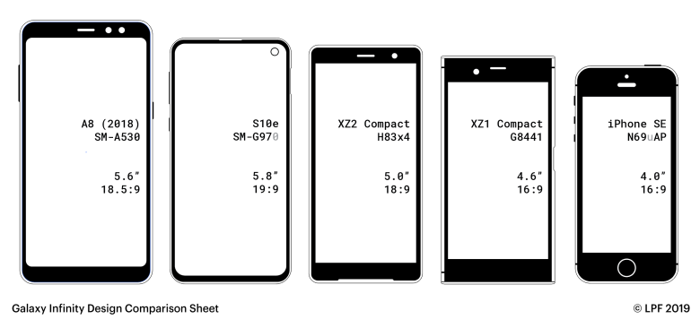
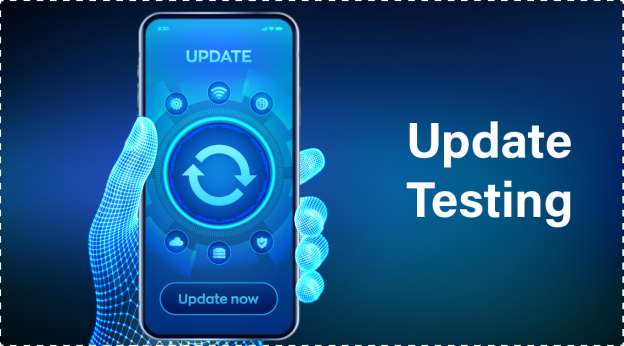
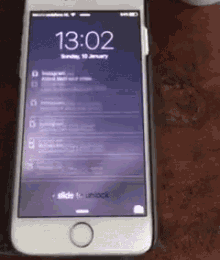

import Highlight from '@site/src/components/Highlight';


To uncover problems in various environments and scenarios before the client does, mobile testers need a variety of methodologies. For QA team members and testers, the following recommendations in this article on mobile testing approaches are an excellent place to start.

# Hardware Specific Testing: Device Fragmentation

#### Also known as Testing the App with Different screen Size and modes (potrait/landscape)



- Device fragmentation is likely the answer you will get from most mobile testers when you ask them what the biggest problem is in mobile testing, and they are correct.

- This challenge is no longer limited to iOS devices. The same remains true for Android devices and Tablets. The simplest method to deal with device fragmentation is to collect information about your customer base.

- When you are aware of who is using your product and on what device, it is simple to concentrate just on the old phones. I advise you to speak with the product managers of your product because they often have the data from the tracking that has been put in place for your product.

- Consider that there are three groups: A, B, and C. Now, based on usage and importance, add the devices to each category. Your ability to concentrate on the most crucial devices within your client base will be aided by the grouping of the devices.


# Mobile Data Networks: Testing in the isolation


- Testing and examining your mobile application over several mobile data networks 📶 is another problem.<Highlight color="#1877F2"> *** It's not advised *** </Highlight>to test the app in a <Highlight color="#e06666">lab setting with a strong wifi network </Highlight>.

- This is very Important Because Mobile apps are used while on the move by the majority of mobile users.

- The test app is significantly impacted by the various surroundings and mobile data networks. It is essential to test under all network conditions, including wifi, 5G, 4G, 3G, and even slower network connections like EDGE.

- It’s also recommended to test the app in airplane mode when there is no communication possible from the device to any mobile data network. While performing your testing in the different mobile data networks, watch out for the following:

# Update Testing: Simulating the App Stores

#### Does the App Update affect the previous data?


- Before submitting the app to an app store, it’s recommended to perform an app update test. With this mobile testing technique, you simulate the update process with the app stores and make sure that the release candidate of the app is not affecting the currently installed app version on customer devices. 

- The app update step can be done very easily for Android and iOS. On Android, you can use the command-line tool ADB (android debug bridge) to perform the app update. The following command will do the trick for you:

    ```adb install -r YOUR.APP```

- The parameter -r tells ADB to overwrite the existing app with the one mentioned after the -r. With that ADB will perform the app update.

- On iOS, you can use XCode to install the new version over an existing one. Apple does not provide a tool like ADB to easily perform the app update test, which I think is a drawback for developers and testers.

- As you can see, performing an app update test is fairly easy and will protect you from issues that may occur right after the app got updated from the app store 💪 Potential issues to cover with app update testing are:

*** Check for User Login State *** - Users should stay logged in after the app’s update.

*** Check for Local Data *** - Users data should be safe and can access any saved local data.

*** Check for Potential app crashes ***  while performing the App update.

# Interrupt testing : 

#### Does Your App Work when there is a push notification inrerruption?



A mobile user may see 50–80 push notification interruptions on average each day, which can be exhausting. Interrupt testing enables the analysis of the annoyances brought on by these interruptions and the discovery of solutions to provide a seamless mobile experience. different ways that interruptions are

- Incoming or phone call when an application is running
- Incoming message or SMS when an application is running
- Low battery when an application is running
- The device is plugged in or out of charging when an application is running
- Device shutting down when an application is running
- OS upgrade occurring when an application is running
- Loss and restoration of the network while an application is running.

# Some Additional Mobile App Test Checklist 

1. All test cases or testing ideas have been executed for the release and are in the test documentation. This is important to have especially in bigger companies where many teams are working on the product to not lose the quality overview.
2. Test the App in <Highlight color="#25c2a0">portrait</Highlight> and <Highlight color="#25c2a0">landscape mode</Highlight>. If the app supports both views, it’s important to take a look after the screen rotation happens. Sometimes there might be UI glitches.
3. The existing automated checks have been executed and are green. Also, take a look at static checks on the CI systems for potential issues.
4. The app has been approved by a design or interaction design colleague. Especially helpful if new features and user scenarios have been implemented.
5. The battery consumption of the new app release has been checked? Test the current mobile app live version side-by-side with the new release candidate. Perform the same actions and check battery consumption.


Happy Learning :)